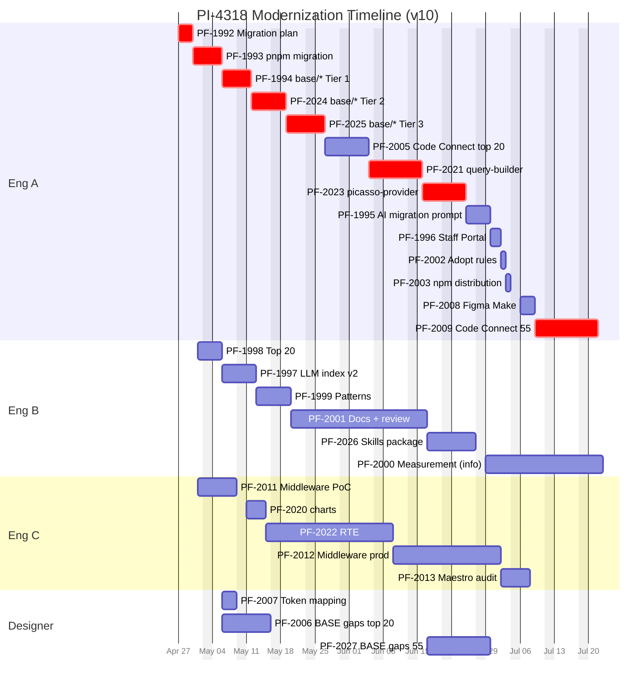

# PI-4318 - Timeline v2 (3-engineer scenario, optimized)

**Parent:** [PI-4318 - Picasso Modernization + AI Developer Experience](https://toptal-core.atlassian.net/browse/PI-4318)
**Cross-references:** [PI-4318-timeline.md](./PI-4318-timeline.md) (v1, 2-engineer scenario), [PI-4318-estimates.md](./PI-4318-estimates.md), [PI-4318-tickets-by-track.md](./PI-4318-tickets-by-track.md), [PI-4318-P1-MOD-01-migration-plan.md](./PI-4318-P1-MOD-01-migration-plan.md)
**ID convention:** Jira keys (PF-XXXX) used throughout. P3-MOD-02, P3-MAE-01, P3-MAE-02 explicitly excluded from PI scope.
**Status:** v10 - Reconciled doc IDs to Jira keys (PF-1994a/b/c → PF-1994/2024/2025; PF-2001a/b → PF-2001/2026; P2-FIG-03 → PF-2027). Program end **Jul 22**.

---

## Key optimization decisions

This v10 reflects the optimized 3-engineer schedule with all v5 scope changes applied: gate decoupled from modernization start (Eng A starts PF-1994 May 6), Eng A absorbs PF-2021/2008/2009 pickups from Eng C, P3-MAE-01/02 excluded from PI scope, Vitor dos/don'ts review (PF-2001c) integrated into PF-2001.

### 1. Decouple Phase 1 gate from modernization start

PF-1994 is technically blocked only by PF-1992 (migration plan) + PF-1993 (pnpm migration), both done by **May 5**. The Phase 1 Go/No-Go gate is a *funding checkpoint*, not a *technical prerequisite* - Phase 0 ([picasso PR #4906](https://github.com/toptal/picasso/pull/4906)) already validated the AI-assisted migration approach.

**New:** Gate becomes an informational measurement running in parallel. PF-1994 starts **May 6** (immediately after PF-1993). PF-2000 (harness + baseline + gate run, 9d effort) moves to Eng B's tail as informational measurement.

### 2. Eng A absorbs sibling + Figma engineering pickups

With Eng C at 50%, Eng C's chain is the long pole. Moving PF-2021 (query-builder), PF-2008 (Figma Make), and PF-2009 (Code Connect 55) from Eng C to Eng A compresses the program substantially. The pickups are skill-coherent with Eng A's existing queue (modernization migrations + .figma.tsx authoring).

### 3. Maestro Phase 3 (P3-MAE-01, P3-MAE-02) excluded from PI scope

Maestro onboarding and "default to Picasso" deferred to post-PI work. The Maestro track now wraps at PF-2013 (audit) on Jul 7. Saves ~3 weeks at the program tail.

**Net effect:** Program end **Jul 22** (with PF-2000 informational measurement) or **Jul 20** if PF-2000 is descoped to a lighter measurement.

---

## Key dates

| Milestone | v6 baseline | v10 (current) |
|---|---|---|
| Program start | 2026-04-27 | 2026-04-27 |
| Eng B starts (50%) | May 1 | May 1 |
| Eng C starts (50%) | May 1 | May 1 |
| PF-1994 starts | May 6 | May 6 |
| Eng A done | Jul 20 | **Jul 20** |
| Eng B done (AIC + PF-2000 informational) | Aug 6 (with PF-2001c) | **Jul 22** |
| Eng C done (Maestro core only) | Aug 7 (with P3-MAE) | **Jul 7** |
| **Program end** | **Aug 7** | **Jul 22** (or Jul 20 if PF-2000 descoped) |
| Total wall-clock | ~14.5 weeks | **~12.5 weeks** |

---

## Resource assumptions

- **Engineer A** - 100% from 2026-04-27. Owns Modernization track end-to-end (PF-1994 -> PF-2023 -> PF-1995 -> PF-1996), plus PF-2005 Code Connect top 20, plus Eng C sibling/Figma pickups (**PF-2021, PF-2008, PF-2009**), plus AIC tail (PF-2002, PF-2003).
- **Engineer B** - 50% from 2026-05-01. Owns Agent Experience track (PF-1997/1998/1999, PF-2001 + PF-2026) plus PF-2000 informational measurement on the tail.
- **Engineer C** - 50% from 2026-05-01. Single engineer at half-time. Owns Maestro track (PF-2011, PF-2012, PF-2013) plus sibling-package migrations (PF-2020 charts, PF-2022 RTE). Wraps Jul 7 - earliest of the three engineers because P3-MAE work is out of scope.
- **Designer** - full availability for design work (BASE spec updates, token mapping). PF-2010 designer onboarding excluded.

The big shift vs v6: **Eng C's chain is much shorter without P3-MAE-01/02**. Eng C wraps Jul 7 instead of Aug 7. The new program end is set by Eng B's PF-2000 informational measurement tail (Jul 22) or Eng A's Mod + Figma pickup chain (Jul 20).

---

## Gantt



**Bar duration convention:**
- Eng A (100%): bar length = man-days
- Eng B (50%): bar length = man-days x 2
- Eng C (50%): bar length = man-days x 2
- Designer: designer-time

**Critical-path tasks** (red `crit`): PF-1992, PF-1993, PF-1994, PF-2021 (Eng A pickup, gates PF-2023), PF-2023, PF-2009 (Eng A pickup, last big task on Eng A's chain). Critical path is entirely Eng A's queue.

---

## Critical path

The longest chain runs through Eng A's expanded Modernization + Figma queue:

```
PF-1992 Migration plan (3d)                              Apr 27-29
  -> PF-1993 pnpm migration (4d)                         Apr 30 - May 5
    -> PF-1994 base/* (14d)                              May 6 - May 25      [no gate wait]
      -> PF-2005 Code Connect top 20 (7d)                May 26 - Jun 3
        -> PF-2021 query-builder (7d) [Eng A pickup]     Jun 4 - Jun 12
          -> PF-2023 picasso-provider (7d)               Jun 15 - Jun 23     [waits for PF-2022 done Jun 9]
            -> PF-1995 AI migration prompt (3d)          Jun 24 - Jun 26
              -> PF-1996 Staff Portal (2d)               Jun 29 - Jun 30
                -> PF-2002 (1d) -> PF-2003 (1d)          Jul 1 - Jul 2
                  -> PF-2008 Figma Make (3d) [pickup]    Jul 3 - Jul 7
                    -> PF-2009 Code Connect 55 (9d) [pickup] Jul 8 - Jul 20
                      -> END (Eng A done)                Jul 20
```

Plus Eng B's PF-2000 informational measurement runs Jun 29 - Jul 22 in parallel; if you count it as part of the program, total program end is **Jul 22**.

Total: ~62 weekdays = **~12.5 weeks** (Apr 27 to Jul 22).

---

## Engineer A schedule (100%)

```
Apr 27 - Apr 29   PF-1992 Migration plan         (3d)
Apr 30 - May 5    PF-1993 pnpm migration         (4d)
May 6 - May 25    PF-1994 packages/base/*        (14d) [starts immediately, no gate wait]
May 26 - Jun 3    PF-2005 Code Connect top 20    (7d)
Jun 4 - Jun 12    PF-2021 query-builder          (7d) [pickup from Eng C]
Jun 15 - Jun 23   PF-2023 picasso-provider       (7d, canary)
Jun 24 - Jun 26   PF-1995 AI migration prompt    (3d)
Jun 29 - Jun 30   PF-1996 Staff Portal           (2d)
Jul 1             PF-2002 Adopt rules            (1d)
Jul 2             PF-2003 npm distribution       (1d)
Jul 3 - Jul 7     PF-2008 Figma Make             (3d) [pickup, Jul 4 Sat]
Jul 8 - Jul 20    PF-2009 Code Connect 55        (9d) [pickup]
```

Eng A wraps **Jul 20**. Fully utilized end-to-end with no idle windows.

## Engineer B schedule (50% from May 1)

Calendar durations are 2x the man-days. Eng B is single-threaded.

```
May 1 - May 5     PF-1998 Top 20                          (3 cal days, 1.5d effort)
May 6 - May 12    PF-1997 LLM index v2                    (5 cal days, 2.5d effort)
May 13 - May 19   PF-1999 Patterns                        (5 cal days, 2.5d effort)
May 20 - Jun 16   PF-2001 Docs + designer dos/don'ts review (20 cal days, ~10d engineer effort + designer wall-clock parallel)
Jun 17 - Jun 26   PF-2026 Skills package                 (8 cal days, 4d effort)
Jun 29 - Jul 22   PF-2000 Measurement (informational)     (18 cal days, 9d effort: harness + baseline + gate run)
```

Eng B wraps **Jul 22**. PF-2001c (separate designer review pass) folded into PF-2001 — designer reviews dos/don'ts during the docs work, no separate handoff. PF-2000 is informational; if descoped to a lighter measurement (~2-3d effort), Eng B wraps ~Jul 6.

## Engineer C schedule (50% from May 1)

Calendar durations are 2x the man-days. Eng C is single-threaded.

```
May 1 - May 8     PF-2011 Middleware PoC          (6 cal days, 3d effort)
May 11 - May 14   PF-2020 charts                  (4 cal days, 2d effort)
May 15 - Jun 9    PF-2022 rich-text-editor        (18 cal days, 9d effort; ramps once PF-1994 Tier 1 lands ~May 13)
Jun 10 - Jul 1    PF-2012 Middleware production   (16 cal days, 8d effort)
Jul 2 - Jul 7     PF-2013 Maestro audit           (4 cal days, 2d effort)
```

Eng C wraps **Jul 7**. With P3-MAE-01/02 removed from scope, Eng C's chain ends much earlier.

After Jul 7, Eng C is free for the project. Could be redeployed to:
- Help Eng A parallelize PF-2009 (~9 working days of Eng A's chain). At Eng C 50% helping, PF-2009 could finish ~Jul 14 instead of Jul 20.
- Bug fixes on shipped Maestro Phase 2 work
- Off this project entirely (saves capacity for other PIs)

If Eng C parallelizes PF-2009 with Eng A, program end pulls in to ~Jul 14. Worth considering.

## Designer schedule

```
May 6 - May 8     PF-2007 Token mapping (lead)         (3 cal days, designer + eng review)
May 6 - May 15    PF-2006 BASE spec gaps top 20        (8 cal days, ~6.5d designer effort)
(idle May 18 - Jun 12 — waiting for PF-2001 Picasso component docs)
Jun 15 - Jun 25   PF-2027 BASE spec gaps remaining 55 (9 cal days, ~8d designer effort + ~1d engineer absorption)
```

Designer wraps **Jun 25**. PF-2010 designer onboarding excluded from PI scope.

PF-2027 is new in v8 — closes BASE Figma spec gaps for the 55 components not covered by PF-2006. Required input for PF-2009 (Code Connect 55) to generate clean snippets. Designer-led; engineer absorbs changelog + routes any Picasso-side findings back to PF-2001 (designer review already integrated there).

Crucially, PF-2027 fits in the designer's existing slack (May 18 - Jun 12 was idle), so adding this ticket **does not shift the program end date** — PF-2009 was already gated by Eng A's PF-2008 finishing Jul 7, which is later than PF-2027's Jun 25 finish.

---

## Phase boundaries

| Phase | Start | End | Calendar weeks |
|---|---|---|---|
| Phase 1 - Foundation (parallel non-blocking work) | Apr 27 | Jul 22 (PF-2000 informational gate ends) | 12.5 |
| Phase 2 - Execute (Modernization, AIC, sibling, Maestro core) | May 6 | Jul 7 (last Phase 2 ticket — PF-2013) | 9.0 |
| Phase 3 - Rollout (Eng A pickups only, no Maestro Phase 3) | Jun 29 (PF-1996 starts) | Jul 20 (Eng A done) | 3.0 |
| **Program total** | **Apr 27** | **Jul 22** | **~12.5** |

Phases overlap heavily because the gate is no longer a hard cut-over. With P3-MAE-01/02 out of scope, Phase 3 shrinks to just PF-1996, PF-2002, PF-2003, plus Eng A's Figma pickups (PF-2008, PF-2009).

---

## Parallelism applied

Compared to v5 (gate-blocked, 50%-Eng-C, full Maestro):

1. **PF-1994 starts May 6 instead of Jun 1.** Saves ~17 working days. Biggest single optimization.
2. **PF-2000 moves off Eng A's Phase 1.** Lands on Eng B's tail as informational measurement.
3. **PF-2021 on Eng A.** Saves 14 cal d on Eng C's chain.
4. **PF-2008 on Eng A.** Saves 6 cal d on Eng C's chain.
5. **PF-2009 on Eng A.** Saves 18 cal d on Eng C's chain. Highest-leverage individual pickup.
6. **Sibling packages start earlier on Eng C.** Eng C starts PF-2020 May 11 (after PF-2011) and PF-2022 May 15 (after Tier 1 stabilizes), instead of post-gate Jun 1.
7. **P3-MAE-01/02 excluded.** Saves ~3 weeks at program tail.

What still serializes:

1. **Eng A's chain remains the critical path.** PF-1994 -> PF-2005 -> PF-2021 -> wait for PF-2022 -> PF-2023 -> PF-1995 -> PF-1996 -> AIC tail -> PF-2008 -> PF-2009.
2. **Designer Phase 1 work is unchanged.** PF-2006 + PF-2007 still run May 6-15.
3. **Eng C bottlenecks at 50% on PF-2022 + Maestro core**, but its chain is much shorter without PF-2021/2008/2009 and without P3-MAE.

---

## What would compress further

1. **Have Eng C help with PF-2009.** Eng C is idle Jul 8 onwards. If Eng C parallelizes PF-2009 with Eng A (Eng C 50% helping, takes 25 of the 55 .figma.tsx files), PF-2009 finishes ~Jul 14 instead of Jul 20. Program end ~Jul 17 (with PF-2000 still on Eng B). Saves ~1 week.
2. **Descope PF-2000 to lighter measurement.** Drop the full M1-M8 harness; just do a "single component end-to-end as proof + sentiment survey" (~2-3d effort). Eng B wraps ~Jul 4 instead of Jul 22. Program end becomes Jul 20 (Eng A's chain).
3. **Wire up local Happo from a branch** (per Vedran's note). Could shave ~10-20% off per-component cycle time across PF-1994/2020/2022/2023. Saves ~1 week off PF-1994 (modernization core).
4. **Front-load designer availability.** PF-2006/PF-2007 finishing 1 week earlier pulls PF-2005 forward, but PF-2005 is no longer on the critical path - low leverage.
5. **Bring Eng B to 100%.** Modest impact since Eng B isn't on the critical path.

---

## Risks to schedule

| # | Risk | Likelihood | Impact | Mitigation |
|---|---|---|---|---|
| 1 | Designer not available May 6 onwards | Medium | Low (PF-2005 no longer on critical path) | Confirm designer allocation; PF-2006/PF-2007 still tightly date-pinned but downstream slack absorbs delays. |
| 2 | Peer code review queue on Mod track backs up | Low | Medium | Internal peer review only (designer not in the loop - Happo parity is binary). With 3 engineers, rotate review duty; 1-PR-in-flight WIP limit. |
| 3 | PF-1994 Tier 3 surprises (Page / Accordion / Dropdown) | Medium | High (critical path through PF-2023) | Front-load `PicassoProvider.override` audit per migration plan section 9.5 in PF-1992. |
| 4 | Eng C Tier 1 timing - RTE blocked too long if PF-1994 Tier 1 isn't stable Day 3-5 | Medium | Medium | Eng A prioritizes Typography + FormLabel + Form first within PF-1994. Eng C fills any idle time with PF-2020 (no Tier 1 dep) + RTE scaffolding. |
| 5 | Gate measurement reveals serious issues mid-Phase-2 | Low | High | Phase 0 PR #4906 already validated approach. If gate measurement is poor, ~2-3 weeks of work might need rework. Mitigation: weekly sanity check on Happo deltas during Phase 2. |
| 6 | PF-1993 pnpm migration debugging exceeds 4d | Medium | High (delays PF-1994 start) | Co-coordinate with PI-4278 (Platform Core Q2). Now the single biggest Phase 1 risk because PF-1994 is gated on pnpm. |
| 7 | Eng A overloaded by Mod + sibling/Figma pickups | Low | High | 12 tickets in Eng A's queue but coherent skill clusters. Track velocity weekly; if Eng A falls behind, redistribute PF-2008/2009 back to Eng C. |
| 8 | Eng C dropped to <50% mid-program | Medium | Low (Eng C wraps Jul 7, plenty of slack) | Eng C is no longer on critical path with P3-MAE excluded. |

---

## Update cadence

This timeline is a snapshot. Update when:

- Estimates in `PI-4318-estimates.md` change (re-derive durations).
- Resource allocation changes.
- A Phase boundary milestone slips by >3 working days.
- The informational gate measurement (PF-2000) returns negative - assess whether Phase 2 work needs rework.
- After PF-1994 Tier 1 wraps - re-estimate from real per-component data; refit the rest of Phase 2.

---

## Changelog

- **v10 (2026-04-28)** — Reconciled doc IDs to actual Jira keys: PF-1994a/b/c → PF-1994/PF-2024/PF-2025; PF-2001a/b → PF-2001/PF-2026; P2-FIG-03 → PF-2027. No schedule or duration changes.
- **v9 (2026-04-27)** - **PF-2001c removed** (designer dos/don'ts review pass folded into PF-2001). designer reviews each component's dos/don'ts during the docs-generation work; engineer absorbs feedback iteratively. PF-2001 slightly bumped from 18 to 20 cal d (~10d engineer effort to absorb iterative review). Eng B chain: PF-2001c (4 cal d) removed, net savings 2 cal d. Eng B wraps Jul 22 (was Jul 24). Program end: Jul 24 → Jul 22.
- **v8 (2026-04-27)** - Added **PF-2027 — Update BASE Design System spec gaps (remaining 55)** to the Designer track. New ticket, symmetric with PF-2006 (top-20). Required prerequisite for PF-2009 (Code Connect 55) to generate clean snippets. Fits in designer's existing slack (Jun 15 - Jun 25), no impact on program end.
- **v7 (2026-04-27)** - Two changes: (1) **P3-MAE-01 and P3-MAE-02 removed from PI scope** - Maestro adoption deferred to post-PI. Eng C wraps Jul 7 instead of Aug 7. Saves ~3 weeks at program tail. (2) **Mermaid Gantt restructured by engineer** to fix rendering issue with cross-section forward references and overly long section names. Program end shifts from Aug 7 to **Jul 24** (or Jul 20 if PF-2000 descoped).
- **v6 (2026-04-27)** - Optimization pass: gate decoupled from modernization start (PF-1994 starts May 6); Eng A absorbs PF-2021/2008/2009 pickups from Eng C. Program end Sep 17 -> Aug 7.
- **v5 (2026-04-27)** - Eng C/D pair (combined 100%) replaced with single Eng C at 50%.
- **v4 (2026-04-27)** - Validity sweep against v5 estimates. PF-2001 split rendered in Mermaid; dates corrected for US Jul 4 weekend.
- **v3 (2026-04-27)** - v5 scope changes from estimates doc applied.
- **v2 (2026-04-27)** - Initial 3-engineer scenario doc adding Eng C + Eng D pair.
