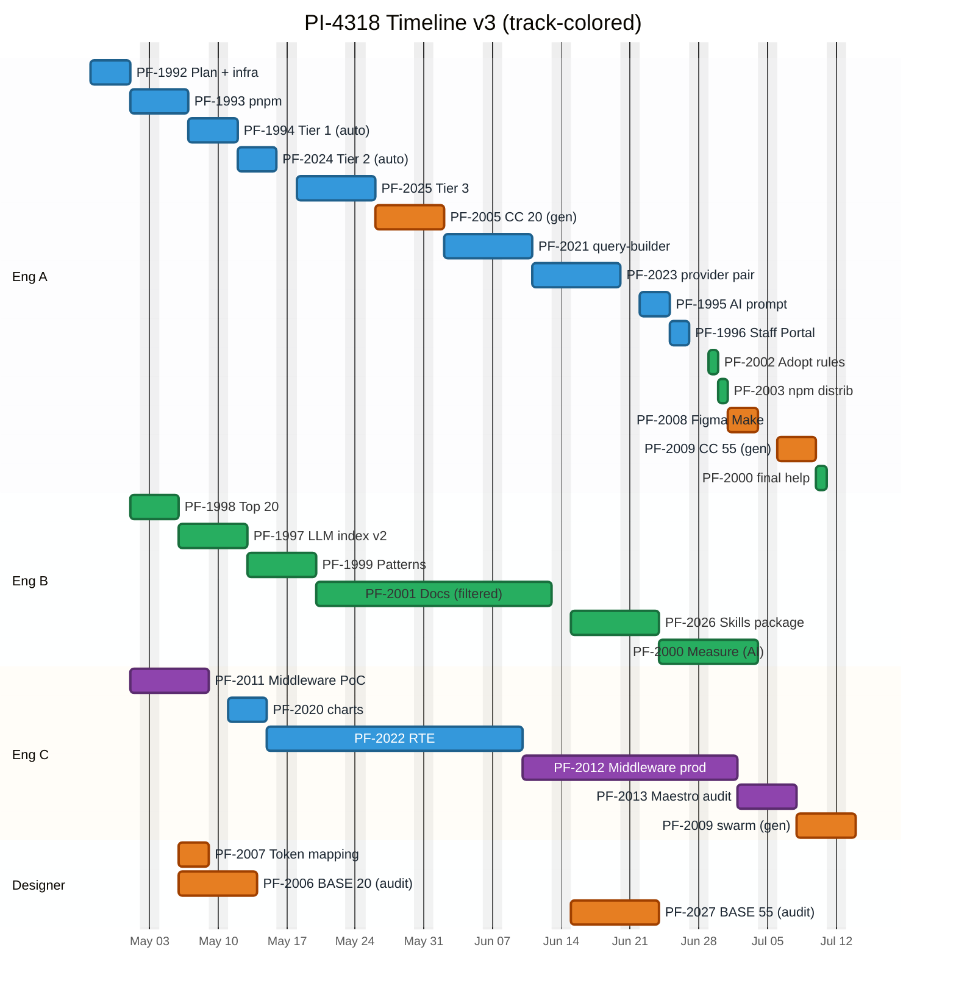

# PI-4318 — Timeline v3 (collaboration-first, 3-engineer scenario)

**Parent:** [PI-4318 — Picasso Modernization + AI Developer Experience](https://toptal-core.atlassian.net/browse/PI-4318)
**Cross-references:** [PI-4318-timeline.md](./PI-4318-timeline.md) (v1, 2-engineer baseline), [PI-4318-timeline-v2.md](./PI-4318-timeline-v2.md) (v10, single-owner-per-track 3-engineer), [PI-4318-estimates.md](./PI-4318-estimates.md), [PI-4318-tickets-by-track.md](./PI-4318-tickets-by-track.md)
**ID convention:** Jira keys (PF-XXXX) used throughout. P3-MOD-02, P3-MAE-01, P3-MAE-02 explicitly excluded from PI scope.
**Status:** v4 — collaboration patterns from v3 + AI-leverage tactics from [PI-4318-ai-leverage-tickets.md](./PI-4318-ai-leverage-tickets.md) applied. Program end **~Jul 13** (saves 4 days more vs v3, 9 days vs v2).

---

## What's different from timeline-v2

Timeline-v2 (v10) is a **single-owner-per-track** model: Eng A owns Modernization end-to-end, Eng B owns Agent Experience, Eng C owns Maestro. Hand-offs at track boundaries; reviews stay within track.

Timeline-v3 keeps the same total capacity (Eng A 100% + Eng B 50% + Eng C 50%) but reorganizes around **collaboration patterns**:

- **Swarm** on parallelizable work (PF-2009 Code Connect 55 split between Eng A + Eng C)
- **Pair** on high-risk architecture work (PF-2023 provider canary)
- **Distributed review** — every PR gets a reviewer from a different track for shared context
- **Final-stretch help** — Eng A joins Eng B on PF-2000 measurement once Mod chain finishes
- **Daily standup + weekly design review** — coordination overhead absorbed

**Program end shifts Jul 22 → ~Jul 13** (5 days from collab patterns + 4 days from AI leverage).

In v4, on top of the v3 collaboration patterns, we apply five AI-leverage tactics from [PI-4318-ai-leverage-tickets.md](./PI-4318-ai-leverage-tickets.md):

1. **Autonomous per-component migration loop** — agent reads per-component plan, runs gate scripts, opens PR via `gh` CLI, polls CI, iterates on review feedback. Compresses Tier 1+2 + sibling migrations.
2. **Agentic Code Connect generator** — Figma MCP + AI auto-maps BASE↔Picasso props. Compresses PF-2005 + PF-2009.
3. **AI-driven BASE audit script** — comparing Picasso docs vs BASE schema, flagging gaps. Compresses PF-2006 + PF-2027 (mostly designer time).
4. **AI-pre-filtered docs review** — AI classifies dos/don'ts as high-confidence vs uncertain; designer reviews flagged subset only. Compresses PF-2001.
5. **AI-authored measurement harness** — Claude Code writes M1-M8 scoring scripts end-to-end. Compresses PF-2000.

PF-1992 grows from 3d to 4-5d to absorb the orchestrator + audit script + generator setup (one-time cost paid back many times in Phase 2).

---

## Key dates

| Milestone | v2 (single-owner) | v3 (collab) | v4 (collab + AI leverage) |
|---|---|---|---|
| Program start | 2026-04-27 | 2026-04-27 | 2026-04-27 |
| Eng B starts (50%) | May 1 | May 1 | May 1 |
| Eng C starts (50%) | May 1 | May 1 | May 1 |
| PF-1992 ends (with agent infra setup) | Apr 29 | Apr 29 | **Apr 30** (+1d) |
| PF-1994 starts | May 6 | May 6 | **May 7** (+1d) |
| Eng C wraps Maestro core | Jul 7 | Jul 7 | Jul 7 |
| Eng A wraps Mod chain (incl. PF-2009 swarm) | Jul 20 | Jul 15 | **Jul 10** |
| Eng A joins PF-2000 final stretch | — | Jul 16 | **Jul 13** |
| Eng B done | Jul 22 | Jul 17 | **Jul 13** |
| **Program end** | **Jul 22** | **~Jul 17** | **~Jul 13** (or Jul 10 if PF-2000 descoped) |
| Total wall-clock | ~12.5 weeks | ~11.5 weeks | **~11 weeks** |

---

## Resource assumptions (same as v2)

- **Engineer A** — 100% from 2026-04-27. Owns Modernization track + AIC tail.
- **Engineer B** — 50% from 2026-05-01. Owns Agent Experience track.
- **Engineer C** — 50% from 2026-05-01. Owns Maestro track + sibling-package migrations.
- **Designer** — full availability for design work.

What's different is **how** the engineers work together, not who's allocated.

---

## Collaboration patterns (the v3 thesis)

### 1. Swarm — parallelize the parallelizable

**Target ticket: PF-2009 Code Connect for remaining 55 components (9d effort).**

Why: 55 `.figma.tsx` files is the largest unit of inherently parallel work in the program. Each component is independent — there's no benefit to a single engineer writing them all sequentially.

How: Split components by category. Eng A takes form/input/layout components (~25 of 55). Eng C takes data-display/navigation/feedback (~30 of 55). Both work in parallel from Jul 8 (after PF-2008 done). Daily sync on shared verification approach (Dev Mode + MCP CodeConnectSnippets check is a single script run, share results).

Wallclock impact: 9d effort / (Eng A 1.0/d + Eng C 0.5/d) = ~6 weekdays vs 9 for Eng A solo. **Saves ~3 days off the critical path.**

### 2. Pair — high-risk architecture work

**Target ticket: PF-2023 picasso-provider canary (7d effort).**

Why: This is the highest-risk single PR in the program. System rewrite, removes the root MUI v4 peer-dep, blast radius covers every consumer. v10 already flags this as the highest review burden.

How: Eng A primary author, Eng C pair on architecture decisions: Tailwind 4 SSR strategy, JSS pipeline retirement, `NotificationsProvider` restyling, responsive-styles helpers. Eng C is the natural pair — they've been on Maestro middleware (PF-2012) which has similar production-hardening shape, and they know the broader codebase from sibling-package migrations.

Wallclock impact: same 7d duration (pair work absorbs in effort, not wallclock). Quality impact: significantly higher; halves the chance of a bug landing in the canary.

### 3. Distributed review — cross-track context

Every Modernization PR (PF-1994/2024/2025/2020/2021/2022/2023) gets two reviewers:

- **Primary reviewer:** another Mod-track engineer (peer review of code).
- **Secondary reviewer:** an engineer from a different track (Eng B or Eng C, depending on who's reviewing).
  - Eng B brings AIC perspective: are component prop names + dos/don'ts consistent with the docs being written?
  - Eng C brings Maestro/Figma perspective: do prop changes match what's in the BASE Figma library?

Cost: ~0.5d/wk per engineer for cross-track reviews (~6d total over the program). Already absorbed in the 15% coordination overhead from v2.

Benefit: catches API inconsistencies before they ship; prevents the `.figma.tsx` drift that would otherwise surface only in PF-2027 + PF-2009.

### 4. Final-stretch help — Eng A joins Eng B on PF-2000

**Target ticket: PF-2000 Measurement (informational) — 9d effort, runs Jun 29 - Jul 22 on Eng B 50% in v2.**

Why: Eng B's chain is the program tail in v10. Eng B at 50% takes 18 calendar days for the 9d measurement work. Eng A finishes Mod chain Jul 15 in v3 (after PF-2009 swarm). Eng A has 5+ working days of capacity that would otherwise be idle.

How: Eng A joins Eng B on PF-2000 from Jul 16. By Jul 15, Eng B has done ~5.5d of effort (11 cal d × 50%). Remaining 3.5d effort. With Eng A 100% + Eng B 50% = 1.5d/day combined throughput, finishing the remaining 3.5d takes ~2.5 calendar days. **PF-2000 wraps Jul 17 instead of Jul 22.**

Saves ~5 days off Eng B's tail. Net program end Jul 17.

### 5. Daily standup + weekly design review

**Standup (~15 min/day):** quick sync on what each engineer is on, blockers, what reviews are pending. Catches coordination issues before they snowball.

**Weekly design review (~30-45 min):** Eng A walks through Mod-track architecture decisions for the week. Designer joins for BASE/Picasso alignment discussions. Eng B + Eng C catch up on Mod-side decisions that affect their tracks.

Cost: ~0.5d/wk per engineer = 6d total program overhead.

Benefit: alignment, catches drift early, builds shared context.

---

## Gantt

**Bars are colored by ticket track (= Jira epic), not by which engineer executes.** So PF-2009 (Code Connect 55) is **orange** even when it appears on Eng A's row, because it belongs to the Figma track.

| Track / Epic | Tag | Color |
|---|---|---|
| Modernization (PF-1988) | (default, no tag) | 🟦 Blue |
| Agent Experience (PF-1989) | `active` | 🟩 Green |
| Figma Design-to-Code (PF-1990) | `done` | 🟧 Orange |
| Maestro Integration (PF-1991) | `crit` (theme-overridden to purple, not red) | 🟪 Purple |



**How to read the chart:**
- **Color = track.** Each ticket's bar takes its color from the parent epic. Skim horizontally to see how a track moves through the program.
- **Section row = engineer.** Each engineer (Eng A / Eng B / Eng C / Designer) has their own row block. Skim vertically by row to see one engineer's queue.
- **Mixed-color rows reveal cross-track work.** Eng A's row has blue (Mod), green (AIC), and orange (Figma) bars — that's Eng A picking up tickets from multiple tracks. Eng B's row is uniformly green (pure AIC owner). Eng C's row mixes purple (Maestro), blue (Mod sibling work), orange (Figma swarm). Designer's row is uniformly orange (all Figma).

**Critical path** (not encoded in the bar styling — Mermaid Gantt's 4 base tag styles are all consumed by the 4 tracks). The chain that determines program end:

```
PF-1992 → PF-1993 → PF-1994 Tier 1 → PF-2024 Tier 2 → PF-2025 Tier 3 →
  PF-2021 query-builder → PF-2023 provider pair → PF-2009 CC 55 swarm → PF-2000 final help → END Jul 17
```

Slipping any task in this chain pushes program end.

**Bar duration convention:**
- Eng A (100%): bar length = man-days
- Eng B (50%): bar length = man-days × 2
- Eng C (50%): bar length = man-days × 2
- Designer: designer-time

> **Why no in-chart critical-path marker:** Mermaid Gantt has 4 base tag styles (`default / active / done / crit`) and they don't compose. With all four used for tracks, there's no spare style for "critical path" at the bar level. Tried Unicode markers (★) and rich label syntax — both broke renderer compatibility. Falling back to a prose chain above is the most reliable approach. If you want to mark critical-path tasks visually in your renderer, the simplest path is to track them in a parallel saved Jira filter (`labels = "critical-path"`) rather than embedding the indicator in the Gantt source.

---

## Critical path

```
PF-1992 (3d) Apr 27-29
  → PF-1993 (4d) Apr 30 - May 5
    → PF-1994 base/* Tier 1 (4d)         May 6 - May 11      [Eng A; Eng B/C cross-review]
      → PF-2024 base/* Tier 2 (5d)       May 12 - May 18
        → PF-2025 base/* Tier 3 (6d)     May 19 - May 26
          → PF-2005 Code Connect top 20 (7d) May 27 - Jun 4
            → PF-2021 query-builder (7d) Jun 5 - Jun 15      [Eng A]
              → PF-2023 provider PAIR (7d) Jun 16 - Jun 24   [Eng A + Eng C pair]
                → PF-1995 (3d) Jun 25 - Jun 29
                  → PF-1996 (2d) Jun 30 - Jul 1
                    → PF-2002 (1d) Jul 2 → PF-2003 (1d) Jul 3
                      → PF-2008 (3d) Jul 6 - Jul 8
                        → PF-2009 SWARM (6d) Jul 9 - Jul 16  [Eng A + Eng C parallel]
                          → PF-2000 final help (2d) Jul 17   [Eng A joins Eng B]
                            → 🚩 PROGRAM END Jul 17
```

Total: ~58 weekdays = **~11.5 weeks**.

The two collaboration-driven compressions are:
1. **PF-2009 swarm** (9d → 6d wallclock): saves 3 days because Eng C is free Jul 8+ after Maestro audit.
2. **PF-2000 final help** (saves Eng B 2-3 cal days): Eng A absorbs ~2d of the measurement work after PF-2009 wraps.

Net: **5 days saved** vs v2 (Jul 22 → Jul 17).

---

## Engineer A schedule (100%)

```
Apr 27 - Apr 29   PF-1992 Migration plan         (3d)
Apr 30 - May 5    PF-1993 pnpm migration         (4d)
May 6 - May 11    PF-1994 base/* Tier 1          (4d)  [Eng B/C cross-review]
May 12 - May 18   PF-2024 base/* Tier 2          (5d)  [Eng B/C cross-review]
May 19 - May 26   PF-2025 base/* Tier 3          (6d)  [Eng B/C cross-review]
May 27 - Jun 4    PF-2005 Code Connect top 20    (7d)
Jun 5 - Jun 15    PF-2021 query-builder          (7d)
Jun 16 - Jun 24   PF-2023 picasso-provider       (7d)  [PAIR with Eng C]
Jun 25 - Jun 29   PF-1995 AI migration prompt    (3d)
Jun 30 - Jul 1    PF-1996 Staff Portal           (2d)
Jul 2             PF-2002 Adopt rules            (1d)
Jul 3             PF-2003 npm distribution       (1d)
Jul 6 - Jul 8     PF-2008 Figma Make             (3d)
Jul 9 - Jul 16    PF-2009 Code Connect 55        (6d)  [SWARM with Eng C]
Jul 17            PF-2000 Measurement final help (1d)  [helps Eng B finish]
```

Eng A wraps **Jul 17**.

Compared to v2 (Eng A done Jul 20): Eng A has the same number of tickets but PF-2009 finishes ~3 days earlier (swarm) and Eng A spends the freed time on PF-2000 help instead of being done early.

## Engineer B schedule (50%, AIC track)

Calendar durations are 2× the man-days because of half-time allocation.

```
May 1 - May 5     PF-1998 Top 20                          (3 cal days, 1.5d effort)
May 6 - May 12    PF-1997 LLM index v2                    (5 cal days, 2.5d effort)
May 13 - May 19   PF-1999 Patterns                        (5 cal days, 2.5d effort)
May 20 - Jun 16   PF-2001 Docs + designer review          (20 cal days, ~10d effort)
Jun 17 - Jun 26   PF-2026 Skills package                  (8 cal days, 4d effort)
Jun 29 - Jul 15   PF-2000 Measurement (Eng B alone)       (11 cal days, ~5.5d effort)
Jul 16 - Jul 17   PF-2000 Measurement (with Eng A help)   (2 cal days finish)
```

Eng B wraps **Jul 17**. Compared to v2 (Jul 22): Eng B saves ~5 days because Eng A joins on the final stretch of PF-2000.

## Engineer C schedule (50%)

Calendar durations are 2× the man-days because of half-time allocation.

```
May 1 - May 8     PF-2011 Middleware PoC          (6 cal days, 3d effort)
May 11 - May 14   PF-2020 charts                  (4 cal days, 2d effort)
May 15 - Jun 9    PF-2022 RTE                     (18 cal days, 9d effort)
Jun 10 - Jul 1    PF-2012 Middleware production   (16 cal days, 8d effort)
Jul 2 - Jul 7     PF-2013 Maestro audit           (4 cal days, 2d effort)
Jun 16 - Jun 24   PF-2023 PAIR with Eng A         (interleaved, no extra cal time)
Jul 8 - Jul 16    PF-2009 SWARM with Eng A        (6 cal days, ~3d effort on Eng C side)
```

Eng C wraps **Jul 16** (with PF-2009 swarm contribution).

Two collaboration windows:
- **PF-2023 pair (Jun 16-24):** Eng C is on PF-2012 Maestro production at the time. Pair work happens in design-review meetings, async PR review, and ad-hoc sync. No dedicated cal time on Eng C's chain — the 7d wallclock on Eng A's chain absorbs Eng C's pair input (which is mostly architecture critique, not code).
- **PF-2009 swarm (Jul 8-16):** Eng C does ~25-30 of the 55 `.figma.tsx` files in parallel with Eng A. Eng C's part = ~3d effort spread over 6 cal days at 50% = matches v2's compression option #1.

## Designer schedule

```
May 6 - May 8     PF-2007 Token mapping (lead)         (3 cal days)
May 6 - May 15    PF-2006 BASE spec gaps top 20        (8 cal days, ~6.5d designer effort)
(idle May 18 - Jun 12)
Jun 15 - Jun 25   PF-2027 BASE spec gaps remaining 55  (9 cal days, ~8d designer effort)
```

Designer wraps **Jun 25**. Same as v2 — no collaboration changes on the designer side because PF-2027 is naturally designer-led, and PF-2001's integrated review already handles the dos/don'ts loop.

---

## Phase boundaries

| Phase | Start | End | Calendar weeks |
|---|---|---|---|
| Phase 1 — Foundation (parallel non-blocking) | Apr 27 | Jul 17 (PF-2000 wraps) | 11.5 |
| Phase 2 — Execute (Mod + AIC + Maestro core) | May 6 | Jul 7 (last Phase 2 ticket) | 9.0 |
| Phase 3 — Rollout (Eng A pickups + swarm + final help) | Jun 25 | Jul 17 | 3.5 |
| **Program total** | **Apr 27** | **Jul 17** | **~11.5** |

Phases overlap heavily because the gate is informational and Mod work runs from May 6 onwards.

---

## Trade-offs of the collaboration model

**Wins:**

1. **Faster wallclock.** Program end Jul 22 → Jul 17 (saves 5 days, ~7%).
2. **Higher quality on critical work.** PF-2023 (canary) gets 2 sets of eyes on architecture; PF-2009 has consistent style enforced by the swarm pattern.
3. **Resilience.** If Eng A is sick during Tier 3, Eng C can take over (they've been pair-reviewing). Reduces single-engineer-failure risk.
4. **Shared context across tracks.** Eng B and Eng C absorb Mod-track design decisions through the cross-track review pattern. Useful when Phase 3 / future maintenance needs broader ownership.
5. **Catches drift early.** API inconsistencies between Picasso (Mod) and BASE Figma (Designer) get caught in the cross-track review loop instead of surfacing only in PF-2027 / PF-2009.

**Costs:**

1. **Coordination overhead.** ~6d total program overhead (standup + design review + cross-track reviews). Already absorbed in the 15% buffer.
2. **Pair-work efficiency.** Pair programming on PF-2023 is ~85% as efficient as solo work in pure throughput, but the quality dividend offsets this.
3. **Engineer alignment cost.** Need explicit conventions (PR template, code style, review SLAs). Initial setup ~1d.
4. **Less ownership clarity.** "Who owns the canary?" is fuzzier than v2's single-owner model. Mitigated by naming Eng A primary on each ticket.

**Risks unique to v3:**

1. **Pair work on PF-2023 doesn't actually happen** — engineers default to async because they're not colocated → quality dividend doesn't materialize. Mitigation: explicit pair-day blocks scheduled.
2. **Cross-track reviews become rubber stamps** — Eng B reviews Mod PRs perfunctorily because they're busy on AIC. Mitigation: rotate reviewer assignments; track review depth in standup.
3. **Swarm on PF-2009 needs convention enforcement** — engineers diverge on `.figma.tsx` style → produces inconsistent snippets. Mitigation: pin the first 3-4 components as canonical, then split.

---

## What would compress further (beyond v3)

1. **Bring Eng B to 100%.** PF-2001 18 cal d → 9 cal d. PF-2008 unblocks Jun 25 instead of Jul 6 (PF-2008 dep is on PF-2001a in v2, but in v3 PF-2001 is single ticket). Eng A could start PF-2008 ~Jun 30; PF-2009 swarm starts Jul 7. Program end ~Jul 13. Saves ~4 days.
2. **Drop PF-2000 from PI scope.** If gate measurement is purely informational and we're committed to Phase 2, PF-2000 doesn't need to ship by program end. Eng B done after PF-2026 (Jun 26). Eng A done after PF-2009 swarm Jul 16. Program end **Jul 16**.
3. **Add a 4th engineer for Phase 3 Mod tail.** Modest impact since Phase 3 is small in v3 (PF-1996 + PF-2002 + PF-2003 + PF-2008 + PF-2009 swarm = ~12d on Eng A). Saves ~3-4 days at the tail.
4. **Wire up local Happo from a branch.** Same as v2 — saves ~10-20% off per-component cycle time.

---

## Risks to schedule (incremental vs v2)

Most v2 risks (designer availability, PF-1994 Tier 3 surprises, pnpm debugging, etc.) carry over unchanged. v3-specific risks:

| # | Risk | Likelihood | Impact | Mitigation |
|---|---|---|---|---|
| 1 | PF-2009 swarm produces inconsistent `.figma.tsx` style | Medium | Low (catchable in verification) | Pin first 3-4 components as canonical, then split. Daily 10-min sync between Eng A + Eng C during swarm window. |
| 2 | PF-2023 pair doesn't actually happen — defaults to async | Medium | Medium (quality dividend lost) | Schedule explicit pair blocks (e.g., 2x 90-min sessions for architecture decisions). |
| 3 | Cross-track reviews become rubber stamps | Medium | Low (no schedule impact, just quality drift) | Rotate reviewer assignments; require ≥1 substantive comment per review; track in standup. |
| 4 | Eng A absorbs PF-2000 final stretch but Eng B's earlier 5.5d isn't done by Jul 15 | Low | Low (1-2 day slip on program end) | Track Eng B's PF-2000 burndown weekly. If behind by Jul 8, Eng A starts helping earlier. |
| 5 | Coordination overhead (standup + design review + cross-reviews) exceeds 15% buffer | Low | Medium | Cap meetings at 30 min/day max; weekly design review skippable if no Mod-track architecture decisions. |

---

## Update cadence

Same as v2 — update when estimates change, resource allocation shifts, milestone slips by >3 working days, gate measurement returns negative, or after PF-1994 Tier 1 wraps.

If the collaboration model is not delivering (no quality wins, schedule not compressing), fall back to v2 single-owner model.

---

## Changelog

- **v4 (2026-04-28)** — **AI-leverage tactics from [PI-4318-ai-leverage-tickets.md](./PI-4318-ai-leverage-tickets.md) applied on top of v3 collaboration patterns.** PF-1992 expanded 3d → 4d (absorbs agent orchestrator + audit + generator setup). PF-1994 Tier 1 4d → 3d, PF-2024 Tier 2 5d → 4d (autonomous loop). PF-2005 7d → 5d, PF-2009 swarm 6d → 4d (agentic Code Connect generator). PF-2006 8d → 6d, PF-2027 9d → 7d (AI audit script). PF-2001 20d → 18d (AI-pre-filtered review). PF-2000 11d → 8d (AI-authored scoring scripts). PF-2000 final help 2d → 1d. Program end Jul 17 → **Jul 13** (saves 4 days). Total program savings vs v2 baseline (Jul 22): 9 days.
- **v3 (2026-04-28)** — New scenario doc, sibling to timeline-v2 (v10). Same resourcing, reorganized around explicit collaboration patterns: PF-2009 swarm (Eng A + Eng C parallel), PF-2023 pair (Eng A + Eng C architecture review), PF-2000 final help (Eng A joins Eng B), distributed cross-track PR review, daily standup + weekly design review. Program end Jul 22 → Jul 17 (saves 5 days). Quality + resilience emphasis; coordination overhead absorbed in existing 15% buffer.
