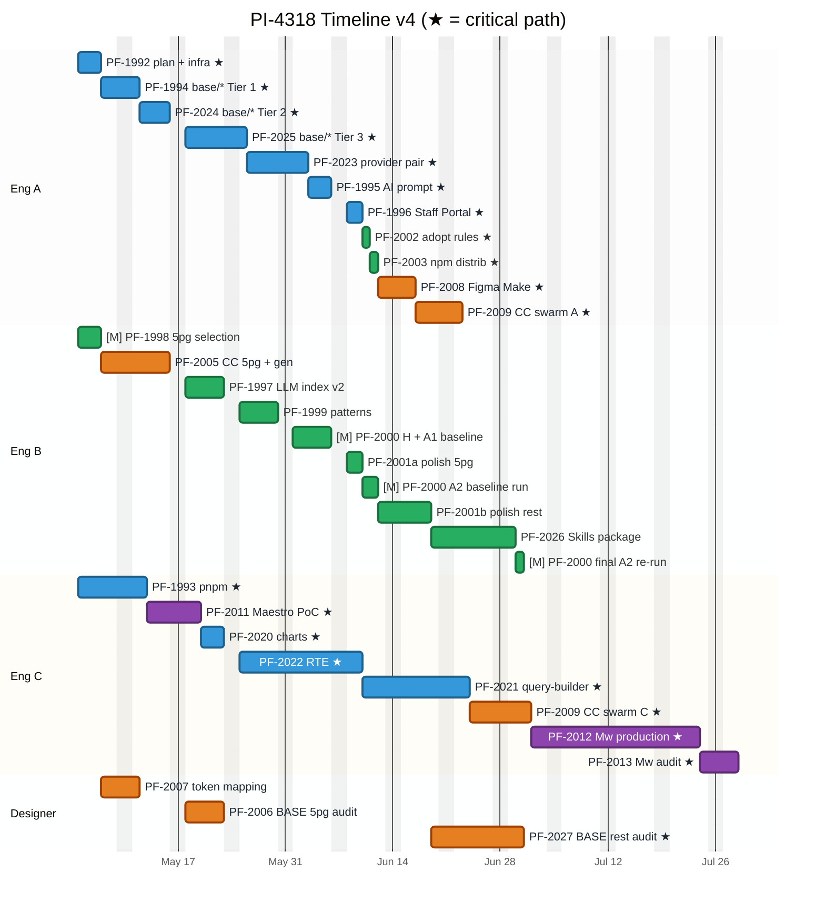

# PI-4318 — Timeline v4 (hybrid baseline + 5-page measurement)

*v2 (2026-04-30): May 4 program start; PF-1992 narrows to migration plan + autonomous-loop infra (no 5-page protocol, no Code Connect / BASE audit scaffolds); PF-1998 narrows to 5-page selection + Picasso component extraction; PF-2000 absorbs measurement protocol + H/A1/A2 runs; PF-2005 owns the agentic Code Connect generator build; PF-2006 owns the BASE audit script build; PF-2001 collapses to polish-only on top of PF-1997 + PF-1999 outputs.*

**Parent:** [PI-4318 — Picasso Modernization + AI Developer Experience](https://toptal-core.atlassian.net/browse/PI-4318)
**Cross-references:** [PI-4318-timeline-v3.md](./PI-4318-timeline-v3.md) (collaboration patterns + AI leverage), [PI-4318-estimates.md](./PI-4318-estimates.md), [PI-4318-tickets-by-track.md](./PI-4318-tickets-by-track.md), [PI-4318-ai-leverage-tickets.md](./PI-4318-ai-leverage-tickets.md)
**ID convention:** Jira keys (PF-XXXX) used throughout. P3-MOD-02, P3-MAE-01, P3-MAE-02 explicitly excluded from PI scope.
**Program start:** Monday 2026-05-04.
**Status:** v4 — Eng B + Eng C 50% start aligned to May 4 (was May 11; they're not blocked by Eng A's PF-1992). Eng B chain reordered so PF-1998 → PF-2005 → (PF-1997 + PF-1999 + …); Designer's PF-2006 now depends on PF-2005 (Code Connect generator + Figma MCP setup) instead of just PF-2007. Saves ~1 week off Eng A wrap (~Jul 6) and ~1 week off Eng B wrap (~Jun 30) and ~1 week off program end (Eng C 50% Jul 28 / 100% Jul 15). v3 changes preserved: v12 track structure (PF-1998 + PF-2000 in Pilot Measurement); ticket scope rearranged so each AI-leverage scaffold lives in the ticket that uses it; PF-2000 owns the entire measurement chain; PF-1998 narrows to selection + extraction; PF-2001 polish-only.

**Headline:** v4 delivers a measurable A1 → A2 AI-DX lift number mid-Phase 1 (~Jun 5 — H+A1 baselines) and a re-validated number at program end. Modernization runs as the parallel backbone via the autonomous agent. Program end depends on Eng C allocation: **~Jul 28 at 50% sustained**, **~Jul 15 at 100% during the Maestro tail**. With Eng B + Eng C aligned to May 4 start (v4) instead of May 11, Eng A wraps ~Jul 6 and Eng B wraps ~Jun 30.

---

## What's different from timeline-v3

Timeline-v3 keeps the original "Phase 1 gated pilot" framing, with `top 20 components` as the gating scope. Timeline-v4 changes both the framing and the scope of the foundation phase:

1. **Phase 1 is hybrid, not gated.** No Go/No-Go decision at week 3. Modernization runs from day 1. AI leverage on agentic migration starts the moment PF-1992 lands. Foundation track works in parallel: 5-page baseline measurement + Code Connect for the components used in those pages + initial BASE fixes + `.picasso/` v2.

2. **5 Staff Portal pages replace top-20 components as the measurement unit.** Pages have implementations *and* Figma specs, so we can measure three concrete numbers head-to-head:
   - **Baseline H** — human-implemented vs. Figma spec (already shipped, score ex post).
   - **Baseline A1** — AI agent + Figma MCP **without** Code Connect, **without** Picasso Agent Experience.
   - **Baseline A2** — AI agent + Figma MCP **with** Code Connect + Picasso Agent Experience layer.
   
   The gap between A1 and A2 is the value the program delivers on the AI-DX side. The gap between A2 and H is the residual ceiling.

3. **Code Connect + BASE fixes scope to the 5-page component set first**, not top-20. The component set extracted from 5 pages is typically 12-18 components (not 20), and they're the ones already in real use. Phase 2 expands BASE + Code Connect to the remaining ~55-60.

4. **PF-2001 split + tightened multiplier.** v3's PF-2001 is 9d effort (18 cal d at Eng B 50%). Splitting docs into "5-page subset" (1.5-2d, lands during Phase 1) + "remaining components" (3.5-4.5d, runs Phase 2) and tightening the AI multiplier from 0.1d/component to 0.05d/component drops total effort to 5-6.5d. Cuts PF-2001's calendar footprint by roughly 30%.

5. **Modernization-first scaling.** Once the orchestrator validates on Tier 1 (~May 5), the autonomous loop runs Tier 2 + Tier 3 + sibling packages largely in the background. Engineers' attention shifts to Code Connect + Agent Experience + measurement during that window — the bulk of human time stops being modernization-bound.

6. **Maestro PoC at start, production at end.** PoC runs Eng C week 1-2 (unchanged from v3). Production middleware (PF-2012) and audit (PF-2013) move to the program tail (Jul 1+) so Eng C's middle window is freed for sibling-package agent supervision and the PF-2009 swarm.

7. **Engineers pair on the same track where it accelerates work.** Eng A + Eng C pair on PF-2023 provider canary (high-risk system rewrite, same as v3). Cross-track PR review on Tier 1/2/3 (Eng B + Eng C as secondary reviewers, ~30 min per PR). Eng A + Eng C async architecture pair on Tier 3 (PicassoProvider.override patterns) sets up Eng C for PF-2023. *Note: the v3 plan had Eng A + Eng B pair on PF-1992 agent infra, but in v4-v4 with both starting May 4, Eng A goes solo on PF-1992 while Eng B starts PF-1998 — the pair pattern there is replaced by a half-day Note-sandbox shadow where all 3 engineers watch the first orchestrator run.*

**Program end:** Maestro production pushed to the tail extends Eng C's chain. At Eng C 50% sustained, program ends **~Jul 28** (~2 weeks later than v3). At Eng C 100% for the final 3 weeks, program ends **~Jul 15** (~2 days later than v3). The 5-page approach mainly reshapes the *front* of the timeline, not the critical-path *length*. The PF-2001 split + the May 4 Eng B/C alignment save Eng B's tail (Eng B wraps ~Jun 30 instead of ~Jul 13) but Eng B is no longer the determining engineer in v4.

---

## Why hybrid (not modernization-first or AIC-first)

**Modernization-first** would be: finish all 75 component migrations + provider canary + Staff Portal migration before touching Code Connect / Agent Experience for production. Pros: clean stack, no re-doing AIC/CC artifacts. Cons: zero AI-DX value delivered until late in the program; no early signal on whether BASE → Picasso → AI agent loop actually works.

**AIC-first** would be: finish Code Connect + BASE alignment + Agent Experience docs for all 75, then modernize Picasso. Pros: AI-DX value delivered early. Cons: AIC docs written against the old MUI v4 stack get re-done as components migrate; designer's BASE work churns when Picasso props change.

**Hybrid (v4 thesis)** picks both: modernize Picasso aggressively in the background via the autonomous agent, *and* ship Code Connect + Agent Experience + BASE fixes for the 5-page subset early enough to measure the A1 → A2 lift. The 5-page set is small enough that the AIC/CC churn risk is bounded — components used in those pages are likely Tier 1/2 primitives that get migrated in the first 2-3 weeks anyway. By the time the 5-page measurement runs at the end of Phase 1, the Picasso side of the pipeline is partially modernized and the AI agent has a real-world target.

The cons of hybrid: more coordination, mixed-track focus per engineer, slightly more work absorbed in PF-1992 (5-page selection logic, baseline-run protocol) than in v3.

---

## Key dates (v2)

| Milestone | v4 (v3, May 11 Eng B/C start) | v4 (v4, May 4 Eng B/C start) |
|---|---|---|
| Program start | 2026-05-04 | 2026-05-04 |
| Eng B starts (50%) | May 11 | **May 4** |
| Eng C starts (50%) | May 11 | **May 4** |
| Designer starts | May 11 | **May 7** (after PF-1998 ships the component-set) |
| PF-1992 ends (Eng A) | May 6 | May 6 |
| PF-1994 Tier 1 starts (autonomous, Eng A) | May 7 | May 7 |
| **PF-1998 5-page selection done (Eng B)** | May 13 | **May 6** (1 week earlier) |
| **PF-2005 Code Connect generator + 5-page CC done (Eng B)** | Jun 12 | **May 15** (4 weeks earlier — pulled to immediately after PF-1998) |
| Eng C wraps Maestro PoC | May 25 | **May 19** |
| PF-2025 Tier 3 done (Eng A) | May 27 | May 25 |
| PF-2023 provider canary done (Eng A) | Jun 4 | Jun 2 |
| **5-page baseline H + A1 measured (PF-2000)** | ~Jun 5 → actually Jun 25 in v3 calc | **~Jun 5** |
| **5-page A2 measured (PF-2000)** | ~Jun 19 | **~Jun 11** |
| Eng A wraps Mod chain (incl. PF-2009 swarm) | ~Jul 13 | **~Jul 6** |
| Eng B done | ~Jul 15 | **~Jun 30** |
| Eng C starts Maestro production (PF-2012) | ~Jul 9 | **~Jul 2** |
| Eng C wraps Maestro audit (PF-2013), 50% sustained | ~Aug 4 | **~Jul 28** |
| Eng C wraps Maestro audit (PF-2013), 100% from Jul 2 | ~Jul 22 | **~Jul 15** |
| **Program end (Eng C @ 50% sustained)** | ~Aug 4 | **~Jul 28** |
| **Program end (Eng C bumped to 100% tail)** | ~Jul 22 | **~Jul 15** |
| Total wall-clock | 13 / 12 wks | **~12 / 11 wks** |

**Reading the table:** Aligning Eng B + Eng C to the May 4 program start (instead of waiting until May 11) saves ~1 week off every downstream milestone. The biggest beneficiary is PF-2005 — pulled forward 4 weeks because it now starts immediately after PF-1998 instead of after PF-2000 H+A1. The Eng C 50% vs 100% lever is unchanged; **allocation decision required by ~Jun 1.**

---

## Resource assumptions

All three engineers start Monday May 4 (v4-v4 alignment — Eng B/C are not blocked by Eng A's PF-1992):

- **Engineer A** — 100% from 2026-05-04. Owns Modernization track end-to-end + the agent orchestrator + PF-2023 canary.
- **Engineer B** — 50% from 2026-05-04. Owns Agent Experience track + Pilot Measurement track (PF-1998 + PF-2000 H/A1/A2/final) + PF-2005 Code Connect generator.
- **Engineer C** — 50% from 2026-05-04. Owns Maestro track + sibling-package supervision (charts/QB/RTE — agent-driven, Eng C reviews) + Code Connect ~60 swarm.
- **Designer** — full availability for design work. Starts after PF-1998 ships the component-set (~May 7). Front-loaded on PF-2007 token mapping + PF-2006 5-page BASE fixes (Phase 1), then PF-2027 full-scope BASE remaining ~60 (Phase 2).

What changes is **what each engineer works on in Phase 1**, not their total allocation.

---

## Phase shape

```
Phase 1 — Hybrid foundation (5-page baseline H + A1)     May 4 – Jun 5  (≈5 wks)
  ├─ PF-1992 Migration plan + autonomous-loop infra (Eng A, May 4-6)
  ├─ PF-1993 pnpm migration (Eng C, May 4-12)
  ├─ PF-1998 5-page selection + component extraction (Eng B, May 4-6)
  ├─ PF-2005 Code Connect generator + 5-page CC (Eng B, May 7-15)
  ├─ PF-2007 Token mapping + PF-2006 BASE 5-page audit (Designer, May 7-22)
  ├─ PF-2011 Maestro PoC (Eng C, May 13-19)
  ├─ PF-1994/2024/2025 Tier 1/2/3 autonomous runs (Eng A oversight, May 7-25)
  ├─ PF-1997 .picasso/ v2 + LLM index (Eng B, May 18-22)
  ├─ PF-1999 Patterns merged into .picasso/ (Eng B, May 25-29)
  └─ PF-2000 Baseline H + A1 measured (Eng B, Jun 1-5) — Phase 1 wrap

Phase 2 — Modernization scale-up + full-scope AIC/CC + A2     May 18 – Jul 6  (≈7 wks)
  ├─ PF-2023 picasso-provider canary (Eng A + Eng C pair, May 26-Jun 2)
  ├─ PF-2020/2022/2021 sibling packages (Eng C, May 20-Jun 23, autonomous + review)
  ├─ PF-2001a polish 5-page docs (Eng B, Jun 8-9)
  ├─ PF-2000 A2 baseline run (Eng B, Jun 10-11) — headline lift number
  ├─ PF-2001b polish remaining ~60 + tokens + llms-full.txt (Eng B, Jun 12-18)
  ├─ PF-2027 BASE audit on remaining ~60 (Designer + AI script, Jun 19-30)
  ├─ PF-2026 Skills package (Eng B, Jun 19-29)
  └─ PF-2009 Code Connect swarm for remaining ~60 (Eng A + Eng C, Jul 1-8)

Phase 3 — Rollout + Maestro tail + final measurement     Jun 5 – Jul 28 @50% / Jul 15 @100%  (≈4.5 / 2.5 wks)
  ├─ PF-1995 AI migration prompt + worked examples (Eng A, Jun 3-5)
  ├─ PF-1996 Staff Portal migration (Eng A autonomous loop, Jun 8-9)
  ├─ PF-2002 adopt rules in Staff Portal (Eng A, Jun 10)
  ├─ PF-2003 npm distribution of Agent Experience (Eng A, Jun 11)
  ├─ PF-2008 Figma Make guidelines + template (Eng A, Jun 12-16)
  ├─ PF-2012 Maestro middleware production (Eng C, Jul 2-23 @50% / Jul 2-13 @100%)
  ├─ PF-2013 Maestro audit O4 baseline (Eng C, Jul 24-28 @50% / Jul 14-15 @100%)
  └─ PF-2000 final A2 re-run (Eng B, Jun 30) — validates A2 numbers stick
```

---

## Phase 1 in detail (the hybrid foundation)

Four parallel work-streams run from day 1:

### Stream 1 — Modernization plan + agent infrastructure (Eng A solo from May 4)

**PF-1992 — 3d (v2 scope-tightened, was 5d in v1).**
- Migration plan content (scope, tiering, per-component plans, AI prompt, testbed). Eng A solo.
- **Autonomous migration loop scaffolds only** — `bin/migration-orchestrator.ts`, `bin/migration-gate.sh`, `bin/migration-diff.sh`, `docs/migration/manifest.json`, `docs/migration/ORCHESTRATOR.md`, `gh` CLI auth.
- The agentic Code Connect generator (`bin/generate-code-connect.ts`) **moves out** to PF-2005, which is the first ticket that uses it.
- The BASE audit script (`bin/base-audit.ts`) **moves out** to PF-2006, which is the first ticket that uses it.
- The 5-page measurement protocol (selection criteria, scoring rubric, 3-condition runner) **moves out** to PF-2000, which owns the measurement end-to-end.
- Eng A's first run on Note (smallest Tier 1, sandboxed) validates the orchestrator end-to-end on May 6.
- PF-1992 ships as a normal Picasso PR — full test suite + Happo + standard PR review approval.

### Stream 2 — pnpm + Maestro PoC (Eng C 50% from May 4)

**PF-1993 pnpm (3.5d effort, 7 cal d at 50%).** May 4 - May 12.
Conversion + CI debugging. Co-dependent with PI-4278.

**PF-2011 Maestro PoC (2.5d effort, 5 cal d at 50%).** May 13 - May 19.
Figma REST API PoC + comparison vs Figma MCP + productionization estimate. Output is a PoC repo, not production wiring.

Eng C is then free for sibling-package agent supervision from ~May 20.

### Stream 3 — 5-page baseline (Eng B 50% from May 4; PF-1998 + PF-2005 + PF-1997 + PF-1999 + PF-2000)

In v2 the work splits cleanly between two tickets:

**PF-1998 (v4 scope) — Select 5 Staff Portal pages + extract Picasso component set (1.5d effort, 3 cal d at 50%).** May 4 - May 6.
- Select 5 Staff Portal pages with shipped implementations *and* Figma design specs.
- Extract the Picasso component set used (typically 12-18 components, mostly Tier 1/2 primitives).

Outputs:
- `pilot/5-pages.md` — page selection + Figma spec links.
- `pilot/component-set.md` — Picasso components used (the working set for Stream 4 below).

**PF-2000 (v2 scope) — Measurement protocol + H + A1 + A2 + final A2 re-run (4d effort, 8 cal d at 50%).** May 14 - Jun 5 (initial H + A1 publication).
- Author the 5-page measurement protocol — selection criteria already covered, plus scoring rubric M1-M5, 3-condition runner (H / A1 / A2), reporting templates. ~1d effort.
- Run **Baseline H** — score the existing human implementations against the Figma specs. ~0.75d effort.
- Run **Baseline A1** — AI agent + Figma MCP, no Code Connect, no `.picasso/`. ~0.75d effort.
- Publish `pilot/reports/baseline-pre-pipeline.md` comparing H vs A1.
- (Phase 2) Run **A2** baseline once PF-2005 + PF-1997 + PF-2001a land. ~0.75d effort.
- (Phase 2 wrap) Final A2 re-run after full-scope PF-2001b + PF-2027 + PF-2009. ~0.5d effort.
- Pilot engineer sentiment survey + write-up. ~0.5d.

H + A1 done end of Week 5 (~Jun 5).

**PF-1997 — `.picasso/` v2 + LLM index optimization (2.5d effort, 5 cal d at 50%).** Runs after PF-1998 ships the component set. **In v2 this also produces the lean Storybook-derived component docs** that PF-2001 will polish.

**PF-1999 — Pattern extraction (2.5d effort, 5 cal d at 50%).** AI mines patterns from how Picasso is used in the 5 pages + cross-references the broader 23-repo corpus. **Patterns merge directly into `.picasso/`** (no separate pattern doc), feeding both PF-1997 rules v2 and the lean docs that PF-2001 polishes.

### Stream 4 — Initial Code Connect + BASE fixes for the 5-page component set (parallel)

**PF-2007 — Token mapping (Designer, 3 weekdays).** May 7 - May 11. Runs after PF-1998 ships the component set.

**PF-2005 (v4) — Agentic Code Connect generator + 12-18 `.figma.tsx` files for the 5-page subset (Engineer 3.5d effort, 7 cal d at 50%).** May 7 - May 15. v4 pulls PF-2005 forward to land right after PF-1998 — it builds the Figma MCP integration + Code Connect generator that PF-2006 reuses, and unblocks the Designer's audit work. Engineer authors `bin/generate-code-connect.ts` on the way to running it on the first 12-18 components.

**PF-2006 (v4) — BASE audit script + fixes for 12-18 components (Engineer ~1d build + Designer ~3d fixes; 5 weekdays cal).** May 18 - May 22. Runs after PF-2005 (Figma MCP setup + canonical style locked) and PF-2007 (token mapping verified). Engineer authors `bin/base-audit.ts` on the way to running the audit; designer reviews flagged items only.

Run the **A2 baseline** at end of Phase 1 / start of Phase 2 (~Jun 11): same 5 Figma specs through AI agent + Code Connect + `.picasso/` v2. Score and compare A1 → A2 lift.

---

## Phase 2 in detail (modernization scale-up + full-scope expansion)

### Modernization (Eng A primary, agent autonomous)

Once Tier 1 validates, the agent runs:
- **PF-1994 Tier 1 (3d effort, autonomous)** May 7 - May 11. Eng A reviews PRs.
- **PF-2024 Tier 2 (4d, autonomous)** May 12 - May 15. Eng A reviews.
- **PF-2025 Tier 3 (6d, semi-autonomous, architecture floor)** May 18 - May 25. Eng A drives architecture decisions.

Sibling packages (Eng C 50%, agent-driven, Eng C reviews):
- **PF-2020 charts (1.5d effort, 3 cal d)** May 20 - May 22.
- **PF-2022 RTE (6d effort, 12 cal d)** May 25 - Jun 9 (Lexical theme rewrite is the architecture floor; Eng A pair-reviews that one PR).
- **PF-2021 query-builder (5d effort, 10 cal d)** Jun 10 - Jun 23 (after RTE).

### PF-2023 picasso-provider canary (Eng A + Eng C pair, 6d effort)

Runs May 26 - Jun 2 (after Tier 3; pair window with Eng C interleaved with sibling-package work).

System rewrite, highest review burden, removes the root MUI v4 peer-dep. Eng A primary, Eng C pair on architecture decisions (same as v3 §collaboration pattern 2).

### Agent Experience (Eng B continues)

In v2 the doc-generation bulk has already happened in PF-1997 (Storybook → llms.txt) and PF-1999 (patterns merged into `.picasso/`). PF-2001 is **polish-only**:

- **PF-2001a — Polish 5-page-subset docs (0.5-1d effort, 1-2 cal d at 50%)** Jun 8 - Jun 9. Refine auto-generated docs for the 12-18 components used in the 5 pages; designer's quick dos/don'ts review on the polished output. Lands before A2 baseline run.
- **PF-2001b — Polish remaining ~60 docs + tokens + llms-full.txt + designer review (1.5-2.5d effort, 5 cal d at 50%)** Jun 12 - Jun 18. Refine auto-generated docs for the remainder; build `tokens/colors.md` + `tokens/spacing.md` + `tokens/typography.md`; wire `llms-full.txt` CI integration; designer reviews AI-pre-filtered dos/don'ts on the 60 components.
- **PF-2026 — Skills package (4 Skills, 3.5d effort, 7 cal d at 50%)** Jun 19 - Jun 29.

### Figma Design-to-Code (full-scope BASE + Code Connect)

- **PF-2027 — BASE fixes for remaining ~60 components (Designer + AI audit script, ~6-8d designer effort, 8 weekdays)** Jun 19 - Jun 30. Reuses `bin/base-audit.ts` from PF-2006. Blocks PF-2009.
- **PF-2009 — Code Connect for remaining ~60 components (Eng A + Eng C swarm, ~4d effort, 6 cal d)** Jul 1 - Jul 8. Same swarm pattern as v3. Generator playbook is stable after the 5-page subset locks it down.

---

## Phase 3 in detail (rollout + Maestro tail + final measurement)

### Modernization rollout

- **PF-1995 — AI migration prompt + worked examples (1.5-2.5d effort, Eng A)** Jun 3 - Jun 5.
- **PF-1996 — Staff Portal migration (1-1.5d effort, autonomous)** Jun 8 - Jun 9.

### Agent Experience rollout

- **PF-2002 — Adopt rules in Staff Portal (1d effort)** Jun 10.
- **PF-2003 — npm-bundled distribution (1d effort)** Jun 11.

### Figma Make

- **PF-2008 — Figma Make guidelines + template (2-3d effort, Eng A)** Jun 12 - Jun 16.

### Maestro tail

- **PF-2012 — Middleware production (8d effort).** At Eng C 50% sustained: 16 cal d, Jul 2 - Jul 23. At Eng C 100% from Jul 2: 8 weekdays, Jul 2 - Jul 13. **Eng C allocation is the program-tail lever.**
- **PF-2013 — Maestro audit O4 baseline (1.5d effort).** At 50%: 3 cal d (Jul 24 - Jul 28). At 100%: 2 weekdays (Jul 14 - Jul 15). Inventory + spreadsheet.

### Final measurement re-run

Re-run the 5-page baseline rubric *after full Phase 2 lands* — ensures A2 numbers from Phase 1 still hold once the entire BASE library + all 75 components have Code Connect + Agent Experience docs (Phase 2 expansion didn't accidentally regress the 5-page subset). Eng B owns; ~0.5d effort.

---

## Gantt

**Bars are colored by ticket track (= Jira epic), not by which engineer executes.** So PF-2009 (Code Connect 60) is **orange** even when it appears on Eng A's row, because it belongs to the Figma track.

| Track / Epic | Tag | Color | Marker |
|---|---|---|---|
| Modernization (PF-1988) | (default, no tag) | Blue | — |
| Agent Experience (PF-1989) | `active` | Green | — |
| Figma Design-to-Code (PF-1990) | `done` | Orange | — |
| Maestro Integration (PF-1991) | `crit` (theme-overridden to purple) | Purple | — |
| Pilot Measurement (PF-2030, NEW in v12) | `active` (shares AIC green) | Green | **`[M]` prefix on label** |

> **Why the `[M]` workaround.** Mermaid Gantt has only 4 base tag styles (`default` / `active` / `done` / `crit`); a `classDef` for a 5th colour and a `gantt:` config block both broke rendering in our environment. The pragmatic fix: keep the 4 working tag colours (Mod blue / AIC green / Figma orange / Maestro purple), tag Pilot Measurement tasks with `:active` so they share AIC green, and prefix their labels with `[M]` so they're identifiable at a glance. The 4 PF-1998 + PF-2000 bars are: `[M] 5pg selection`, `[M] H + A1 baseline`, `[M] A2 baseline run`, `[M] final A2 re-run`.



**How to read the chart:**
- **Color = track.** Each ticket's bar takes its color from the parent epic. Skim horizontally to see how a track moves through the program.
- **★ marker = critical path.** Tasks marked `★` are on one of the two critical chains (Chain A modernization core or Chain C Maestro tail). Slipping a starred task pushes the program-end date. Tasks without `★` have float — they can slip without moving the end date.
- **Section row = engineer.** Each engineer (Eng A / Eng B / Eng C / Designer) has their own row block. Skim vertically by row to see one engineer's queue.
- **Mixed-color rows reveal cross-track work.** Eng A's row has blue (Mod), green (AIC adoption tickets), and orange (Figma) bars. Eng B's row is mostly green (AIC + Pilot Measurement share the same green by necessity — see legend note); the Pilot Measurement bars are prefixed `[M]` for identification. Eng B's row also has orange (Figma — PF-2005 Code Connect 5-page). Eng C's row mixes purple (Maestro), blue (Mod sibling work), orange (Figma swarm). Designer's row is uniformly orange.
- **Bar duration convention:**
  - Eng A (100%): bar length = man-days
  - Eng B (50%): bar length = man-days × 2
  - Eng C (50%): bar length = man-days × 2
  - Designer: designer-time

**Critical path** (not encoded in bar styling — Mermaid Gantt's 4 base tag styles are all consumed by the 4 tracks). v4 has two parallel chains; the one that finishes last determines program end:

```
Chain A (Eng A — Modernization core):
PF-1992 → PF-1994 Tier 1 → PF-2024 Tier 2 → PF-2025 Tier 3 →
  PF-2023 provider pair → PF-1995 → PF-1996 → PF-2002 → PF-2003 → PF-2008 →
  PF-2009 swarm → 🚩 ENG A DONE ~Jun 24

Chain C (Eng C — Maestro tail at end of program):
PF-1993 pnpm → PF-2011 Maestro PoC → PF-2020 charts → PF-2022 RTE → PF-2021 QB →
  [PF-2023 pair, interleaved] → PF-2009 swarm → PF-2012 Middleware production → PF-2013 audit →
  🚩 ENG C DONE ~Jul 28 @50% sustained, ~Jul 15 @100% from Jul 2
```

Eng C's Maestro tail is the determining chain in v4 — Eng A typically wraps several weeks before Eng C. The Eng C 100% bump is the single biggest schedule lever.

---

## Critical path

**Chain A — Eng A modernization core (~37 weekdays, wraps Jul 6):**
```
PF-1992 (3d) May 4 - May 6                                       [Eng A solo]
  → PF-1994 base/* Tier 1 (3d, autonomous) May 7 - May 11        [Eng A oversight]
    → PF-2024 base/* Tier 2 (4d, autonomous) May 12 - May 15     [Eng A oversight]
      → PF-2025 base/* Tier 3 (6d) May 18 - May 25               [Eng A; architecture floor]
        → PF-2023 provider PAIR (6d) May 26 - Jun 2              [Eng A + Eng C]
          → PF-1995 (3d) Jun 3 - Jun 5
            → PF-1996 Staff Portal (2d) Jun 8 - Jun 9
              → PF-2002 adopt rules (1d) Jun 10
                → PF-2003 npm distrib (1d) Jun 11
                  → PF-2008 Figma Make (3d) Jun 12 - Jun 16
                    → PF-2009 swarm (4d) Jul 1 - Jul 6           [Eng A + Eng C; waits on PF-2027 ending Jun 30]
                      → 🚩 ENG A WRAPS Jul 6
```

**Chain C — Eng C tail (Maestro at end of program):**
```
PF-1993 pnpm (3.5d effort, 7 cal d @50%)        May 4 - May 12
  → PF-2011 Maestro PoC (2.5d effort, 5 cal d)   May 13 - May 19
    → PF-2020 charts (1.5d, autonomous)           May 20 - May 22
      → PF-2022 RTE (6d effort, 12 cal d)         May 25 - Jun 9
        → PF-2021 QB (5d effort, 10 cal d)         Jun 10 - Jun 23
          [→ PF-2023 pair, interleaved with RTE, no extra cal time]
          → PF-2009 swarm (3d on Eng C, 6 cal d) Jun 24 - Jul 1
            → PF-2012 Middleware production
                @50%: 16 cal d (Jul 2 - Jul 23)
                @100% from Jul 2: 8 weekdays (Jul 2 - Jul 13)
              → PF-2013 audit (1.5d effort)
                  @50%: 3 cal d (Jul 24 - Jul 28)
                  @100%: 2 weekdays (Jul 14 - Jul 15)
                  → 🚩 PROGRAM END
                       ~Jul 28 @50% sustained
                       ~Jul 15 @100% from Jul 2
```

Total: 50% sustained ~58 weekdays = **~12 weeks**; 100% tail ~50 weekdays = **~11 weeks**.

The single biggest schedule decision in v4 is Eng C's allocation for the final 3 weeks. Confirm by ~Jun 1.

---

## Engineer A schedule (100%)

```
May 4 - May 6     PF-1992 Migration plan + autonomous-loop infra (3d)
May 7 - May 11    PF-1994 base/* Tier 1 (3d, autonomous run)
May 12 - May 15   PF-2024 base/* Tier 2 (4d, autonomous)
May 18 - May 25   PF-2025 base/* Tier 3 (6d)
May 26 - Jun 2    PF-2023 picasso-provider canary (6d)                  [PAIR with Eng C]
Jun 3 - Jun 5     PF-1995 AI migration prompt (3d)
Jun 8 - Jun 9     PF-1996 Staff Portal migration (2d)
Jun 10            PF-2002 Adopt rules (1d)
Jun 11            PF-2003 npm distribution (1d)
Jun 12 - Jun 16   PF-2008 Figma Make (3d)
Jun 17 - Jun 30   Buffer / tail review (waits on PF-2027 d3 ending Jun 30)
Jul 1 - Jul 6     PF-2009 Code Connect 60 (4d)                          [SWARM with Eng C]
Jul 7+            Free capacity until program end
```

Eng A wraps **Jul 6**. PF-2009 is gated on PF-2027 (Designer's BASE rest audit) finishing Jun 30, so Eng A has a ~2-week gap after PF-2008 ships. That gap is buffer / tail review or could absorb additional Modernization tail work.

## Engineer B schedule (50%, AIC + Pilot Measurement tracks)

Calendar durations are 2× the man-days because of half-time allocation. Eng B starts May 4 (same as Eng A) — no blocker. Eng B owns delivery for both AIC (PF-1997, PF-1999, PF-2001a, PF-2001b, PF-2026, PF-2002, PF-2003) and the Pilot Measurement track (PF-1998 + PF-2000). v4 reorders the chain so PF-2005 lands right after PF-1998 (it's the prerequisite for PF-2006 designer audit and for PF-2000 A2 run later).

```
May 4  - May 6    PF-1998 5-page select + extract (3 cal d, 1.5d effort)
May 7  - May 15   PF-2005 CC generator infra + CC 5-page (7 cal d, 3.5d effort)
May 18 - May 22   PF-1997 LLM index v2 + .picasso/ (5 cal d, 2.5d effort)
May 25 - May 29   PF-1999 patterns (5 cal d, 2.5d effort)               [merge into .picasso/]
Jun 1  - Jun 5    PF-2000 protocol + H + A1 baseline (5 cal d, 2.5d effort)
Jun 8  - Jun 9    PF-2001a polish 5-page (2 cal d, 1d effort)
Jun 10 - Jun 11   PF-2000 A2 baseline run (2 cal d, 1d effort)
Jun 12 - Jun 18   PF-2001b polish remaining + tokens + llms-full (5 cal d, 2.5d effort)
Jun 19 - Jun 29   PF-2026 Skills package (7 cal d, 3.5d effort)
Jun 30            PF-2000 final A2 re-run (1 cal d, 0.5d effort)
```

Eng B wraps **~Jun 30** (~1.5 weeks earlier than v3's Jul 10). The PF-2005 pull-forward is the biggest schedule lever on Eng B's chain.

## Engineer C schedule (50% baseline)

Calendar durations are 2× the man-days at 50%; the final Maestro window is shown both at sustained 50% and at bumped 100%. Eng C starts May 4 (same as Eng A) — no blocker.

```
May 4  - May 12   PF-1993 pnpm migration                  (7 cal d, 3.5d effort)
May 13 - May 19   PF-2011 Maestro PoC                     (5 cal d, 2.5d effort)
May 20 - May 22   PF-2020 charts                          (3 cal d, 1.5d effort, autonomous + review)
May 25 - Jun 9    PF-2022 RTE                             (12 cal d, 6d effort, autonomous + Eng C reviews; Eng A pair-reviews Lexical theme rewrite)
May 26 - Jun 2    PF-2023 PAIR with Eng A                 (interleaved with RTE, no extra cal time — design-review meetings)
Jun 10 - Jun 23   PF-2021 query-builder                   (10 cal d, 5d effort, autonomous + Eng C reviews)
Jun 24 - Jul 1    PF-2009 SWARM with Eng A                (6 cal d, ~3d effort on Eng C side)
Jul 2  - Jul 23   PF-2012 Middleware production @50%      (16 cal d, 8d effort)
Jul 24 - Jul 28   PF-2013 Maestro audit @50%              (3 cal d, 1.5d effort)
                  ----- alternative: Eng C bumps to 100% from Jul 2 -----
Jul 2  - Jul 13   PF-2012 Middleware production @100%     (8 weekdays, 8d effort)
Jul 14 - Jul 15   PF-2013 Maestro audit @100%             (2 weekdays, 1.5d effort)
```

Eng C wraps **~Jul 28 @50% sustained** or **~Jul 15 @100% bump from Jul 2**.

## Designer schedule

Designer starts after PF-1998 ships the component set (~May 7).

```
May 7  - May 11   PF-2007 Token mapping                          (3 weekdays, after PF-1998)
May 18 - May 22   PF-2006 BASE 5-page subset                     (5 weekdays, after PF-2005 + PF-2007; ~3 designer-days + script build absorbed by Eng B)
(idle May 25 - Jun 18)
Jun 19 - Jun 30   PF-2027 BASE remaining ~60 components          (8 weekdays, ~6.5d designer effort, AI audit script reused; after PF-2001b)
```

Designer wraps **~Jun 30**. The mid-program idle window (May 25 - Jun 18) is when Eng B is doing PF-1997 + PF-1999 + PF-2000 H+A1 + PF-2001a + PF-2000 A2 + PF-2001b — none of which need designer. PF-2027 unblocks once PF-2001b ships the polished docs for the remaining ~60 components.

---

## Phase boundaries

| Phase | Start | End | Calendar weeks |
|---|---|---|---|
| Phase 1 — Hybrid foundation (5-page baseline H + A1) | May 4 | Jun 5 (PF-2000 H + A1 wrapped) | 5 |
| Phase 2 — Modernization scale-up + full-scope AIC/CC + A2 | May 18 | Jul 6 (PF-2001b + PF-2027 + PF-2009 done) | 7 |
| Phase 3 — Rollout + Maestro tail + final measurement | Jun 5 | Jul 28 @50% / Jul 15 @100% | 4.5 / 2.5 |
| **Program total @50% sustained** | **May 4** | **~Jul 28** | **~12** |
| **Program total @100% Eng C tail** | **May 4** | **~Jul 15** | **~11** |

Phases overlap heavily (no gate between Phase 1 and Phase 2). The 5-page A1 baseline lands at Phase 1 boundary; A2 lands ~3 weeks into Phase 2; final A2 re-run lands at Phase 3 wrap.

---

## What this delivers vs. v3

**Concrete value at each phase boundary:**

| Phase boundary | v3 deliverable | v4 deliverable |
|---|---|---|
| End of Phase 1 (~3 wks) | Top-20 list, top-20 BASE/CC done, gate measurement | **5-page baseline H + A1 numbers** + 12-18 components with Code Connect + BASE alignment + `.picasso/` v2 |
| End of Phase 2 (~6 wks more) | 75/75 components migrated + 75/75 CC + AIC docs + Skills | Same + **A2 measurement on 5 pages** = the headline AI-DX lift number |
| End of Phase 3 (~2 wks more) | Staff Portal migrated + npm distrib + Maestro production | Same + **final A2 re-run** validates A2 numbers held after full-scope rollout |

The big delta is **measurable AI-DX value at end of Phase 1**. v3 had no such anchor — its gate measurement was informational. v4's 5-page approach turns the same measurement effort into a concrete head-to-head A1 vs A2 comparison on real Staff Portal pages with shipped human implementations.

**Schedule delta:** v4 (v4) saves ~1 week vs v4 (v3) by aligning Eng B + Eng C to the May 4 program start. Versus v3 timeline (Jul 13 end), v4 (v4) ends ~Jul 28 at Eng C 50% sustained (~2 weeks later) or ~Jul 15 at Eng C 100% bump (~2 days later). The trade-off vs v3 is intentional: front-loaded AI-DX value (5-page A1/A2 baseline) and Maestro tail at end of program, at the cost of a 50%-Eng-C tail.

---

## Trade-offs of the hybrid + 5-page model

**Wins:**

1. **Concrete A1 → A2 lift number at Phase 1 wrap.** Headline AI-DX value is measurable and visible to the org.
2. **Less wasted AIC/CC work.** Code Connect + BASE fixes start on the 12-18 components actually in use, not the abstract top-20 (which was usage-derived but at component grain, not page grain).
3. **Modernization runs in the background.** Once agent infra works, Eng A's calendar is freed to support Code Connect / canary work; the autonomous loop runs without blocking anyone.
4. **Maestro production at the tail = predictable end date.** Eng C does sibling-package agent reviews in the middle (low-effort, parallelizable), then concentrates on Maestro at the end (high-focus, non-collaborative work).
5. **PF-2001 is no longer the program tail.** Splitting it pushes the docs work to a normal Phase-2 cadence; Eng B finishes Jul 9.

**Costs:**

1. **More upfront ceremony in PF-1992.** Adding the 5-page baseline-run protocol + 3-condition runner adds ~1d to PF-1992. Worth it because the same protocol runs 3 times (A1 / A2 / final re-run).
2. **Higher coordination during Phase 1.** Four parallel work-streams need explicit sync (daily standup retains its v3 role). Engineers work cross-track during Phase 1 instead of within their owned track.
3. **5-page selection is a real call.** If the 5 pages chosen don't represent the breadth of Picasso usage, A1/A2 numbers don't generalize. Mitigation: pick pages spanning forms, layouts, data-display, navigation, feedback (4-5 of these). Designer + Eng B sign-off on the selection.
4. **Hybrid framing makes the gate decision implicit.** v3 had a Go/No-Go meeting at week 3; v4 has only a measurement readout. If the AIC/CC pipeline isn't lifting numbers, the program continues anyway and the team has to decide mid-flight whether to course-correct. Mitigation: explicit decision review at end of Phase 1 even though there's no formal gate.

**Risks unique to v4:**

1. **5-page measurement protocol is harder than it looks.** Scoring "human implementation vs Figma spec" requires a clear rubric. If rubric is fuzzy, A1/A2 differences are noise. Mitigation: ground rubric in M1-M5 from PF-2000 (already exists in phases doc); designer signs off on rubric before running.
2. **Component set extracted from 5 pages doesn't include enough Tier 2/3 surface.** Then Phase 1 Code Connect work is too narrow and A2 lift looks better than it would on the full 75. Mitigation: deliberately pick at least one page that uses a Tier 3 composite (Page, Accordion, or Dropdown).
3. **Modernization-first scaling assumes agent works.** If autonomous loop validates poorly on Note (Tier 1 sandbox), Phase 2 Modernization slips and the calendar stretches. Mitigation: PF-1992's last day (May 6) is the Note end-to-end run; if it fails, raise the alarm before agent infra is shared with Eng B/C on the Tier 2 wave.
4. **Eng C bumping to 100% for Maestro tail isn't guaranteed.** If Eng C stays at 50%, Maestro tail extends to Jul 21 and program end shifts. Mitigation: confirm allocation by ~Jun 1 so plan can adjust.

---

## What would compress further (beyond v4)

1. **Bring Eng C to 100% for the final 3 weeks (Jul 2 onwards).** Single biggest lever — saves ~2 weeks (Jul 28 → Jul 15). **Required if program needs to match v3's Jul 13 end date.** Confirm allocation by ~Jun 1.
2. **Bring Eng B to 100%.** Eng B's chain wraps Jun 30 at 50%; at 100% it would wrap ~Jun 13 (2 weeks earlier). A2 measurement lands ~May 28 instead of Jun 11. Doesn't change program end (Eng C tail dominates) but ships the A1 → A2 lift number sooner. Worth doing if AI-DX value visibility matters more than calendar parity with Eng C.
3. **Run 5-page measurement as recurring instead of one-shot.** After every Tier 1 / Tier 2 / Tier 3 / sibling milestone, re-run A2. Continuous signal on whether modernization is hurting or helping AI-DX. Cost: ~0.5d per run × ~5 runs = 2.5d Eng B time. Benefit: real-time feedback loop, not just one big measurement at end.
4. **Skip PF-2008 (Figma Make).** Defer to post-PI if not strategic. Saves 3d off Eng A's chain (but Eng A is already done by Jun 17, so doesn't move program end).
5. **Wire up local Happo from a branch.** Same as v3 — saves ~10-20% off per-component cycle time. Already noted in PF-1992 as an optional addition.

---

## Risks to schedule (incremental vs v3)

Most v3 risks (designer availability, Tier 3 surprises, pnpm debugging, PF-2023 pair execution, PF-2009 swarm consistency) carry over. v4-specific:

| # | Risk | Likelihood | Impact | Mitigation |
|---|---|---|---|---|
| 1 | 5-page selection misrepresents Picasso breadth → A1/A2 numbers don't generalize | Medium | Medium (program tells the wrong story to stakeholders) | Pick pages spanning forms, layouts, data-display, navigation, feedback. Designer + Eng B sign-off. |
| 2 | A1 baseline takes longer than 1d (rubric ambiguity, Figma MCP setup friction) | Medium | Low (Phase 1 stretches 1-2 days, no critical-path impact) | Front-load rubric design in PF-1992; pilot A1 run on 1 page before scaling to 5. |
| 3 | Code Connect 5-page subset has coverage gaps (some components don't have BASE counterparts) | Low | Low (compresses subset further; flagged in PF-1998) | Audit happens during PF-1998. Drop / swap any component without clean BASE counterpart. |
| 4 | Maestro tail at end of program means a slip there pushes program end | Medium | High (Eng C wraps determines program end in v4) | Confirm Eng C 100% allocation for final 2 weeks by ~Jun 1; have buffer for production hardening. |
| 5 | Modernization scale-up fails (agent escalation rate >50% on Tier 1) | Low | High (Phase 2 stretches significantly) | Note (Tier 1 sandbox) validates by May 6 (last day of PF-1992). Pause + improve prompt before scaling if rate is high. |
| 6 | A2 measurement at end of Phase 1 shows little A1 → A2 lift | Medium | Medium (program loses its headline AI-DX value, but Modernization continues) | Stage measurement: run after each Phase 1 deliverable lands, not just at end. Catch the lift gap early. |

---

## Update cadence

Same as v3 — update when estimates change, resource allocation shifts, milestone slips by >3 working days, or after PF-1994 Tier 1 wraps.

If the hybrid model is not delivering (5-page A2 measurement shows no lift, or Modernization scale-up fails), fall back to v3 single-track ownership.

---

## Changelog

- **v4 (2026-04-30)** — Eng B + Eng C 50% start aligned to May 4 (not blocked by Eng A's PF-1992). Eng B chain reordered so PF-2005 lands right after PF-1998 (PF-1998 → PF-2005 → PF-1997 → PF-1999 → PF-2000 H+A1 → ...). Designer's PF-2006 now depends on PF-2005 (Code Connect generator + Figma MCP setup) instead of PF-2007 alone. Saves ~1 week off Eng A wrap (Jul 6) + Eng B wrap (Jun 30) + program end (Eng C 50% Jul 28 / 100% Jul 15).
- **v3 (2026-04-30)** — v12 track structure: PF-1998 + PF-2000 split out into a new Pilot Measurement track (Eng B keeps executing; only the track label changes). Mermaid Gantt and calendar dates unchanged. Cross-references in prose updated.
- **v2 (2026-04-30)** — May 4 program start (was Apr 27). Scope rearranged so each AI-leverage scaffold lives in the ticket that uses it: PF-1992 keeps only the autonomous-loop infra (3d, was 5d in v1); PF-2005 owns the agentic Code Connect generator build (3-4.5d, was 2.5-4d); PF-2006 owns the BASE audit script build (2.5-3.5d, was 2-3d). PF-2000 absorbs the entire measurement chain — protocol authoring + H + A1 + A2 + final A2 re-run (3-5d, was 1.5-2.5d). PF-1998 narrows to selection + extraction (1-1.5d, was 2.5-3.5d). PF-2001 collapses to polish-only on top of PF-1997 + PF-1999 outputs (PF-2001a 0.5-1d, PF-2001b 1.5-2.5d, was 1-2d + 4-5d). Eng B/C 50% start moves to May 11. Program end ~Aug 4 @50% sustained / ~Jul 22 @100% Eng C tail.
- **v1 (2026-04-29)** — New scenario doc, sibling to timeline-v3. Reorganized Phase 1 around the 5-page Staff Portal baseline (replaces top-20 components) + 3-condition measurement (H / A1 / A2). Code Connect + BASE fixes scoped to 5-page component subset for Phase 1, expanding to remaining ~60 in Phase 2. PF-2001 split into PF-2001a (5-page docs, 1.5d effort) + PF-2001b (remaining ~60, 4.5d effort) with tighter AI multiplier 0.05d/component (was 0.1d in v3); total effort 5-6.5d (was 9d in v3). Maestro production (PF-2012) + audit (PF-2013) pushed to program tail per v4 directive; Eng C does sibling-package agent supervision in the middle weeks. Modernization-first scaling preserved (autonomous agent runs Tier 1+2+siblings in background while engineers work on AIC/CC/measurement). Eng A + Eng B pair on PF-1992 agent infra setup. Program end **Jul 28 @ Eng C 50% sustained / Jul 15 @ Eng C 100% bump for final 3 weeks** (vs v3's Jul 13 — v4 trades calendar length for early AI-DX value). Eng A wraps Jun 17 (~3 weeks earlier than v3). Eng B wraps Jul 8 (~5 days earlier than v3).
