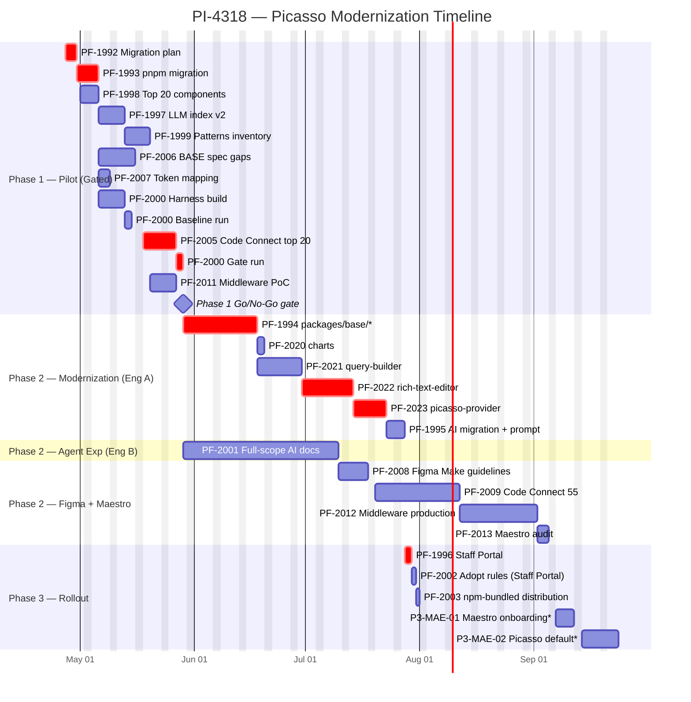

# PI-4318 — Timeline (Mermaid Gantt)

**Parent:** [PI-4318 — Picasso Modernization + AI Developer Experience](https://toptal-core.atlassian.net/browse/PI-4318)
**Cross-references:** [PI-4318-estimates.md](./PI-4318-estimates.md), [PI-4318-tickets-by-track.md](./PI-4318-tickets-by-track.md), [PI-4318-P1-MOD-01-migration-plan.md](./PI-4318-P1-MOD-01-migration-plan.md)
**ID convention:** Jira keys (PF-XXXX) used throughout. Mapping to local story IDs (P1-MOD-01 etc.) is in the per-track tables of [PI-4318-estimates.md](./PI-4318-estimates.md). Missing tickets (not yet in Jira) use the local ID with a `*` marker.
**Status:** Initial schedule. Update as estimates shift or resource allocation changes.

---

## Key dates

| Milestone | Date |
|---|---|
| Program start | **2026-04-27** (Mon) |
| Engineer B starts (50%) | 2026-05-01 (Fri) |
| Phase 1 Go/No-Go gate | **~2026-05-28** (Thu) |
| Phase 2 wrap (Modernization + AIC core) | **~2026-08-04** |
| Phase 3 wrap, no missing tickets (Eng A AIC tail) | **~2026-08-13** (Thu) |
| Phase 3 wrap, with missing Maestro tickets (Eng B tail) | **~2026-09-25** (Fri) |
| Total wall-clock | ~5 months / ~21 working weeks (Eng B chain dominates) |

This is a "happy path" calendar. With +15% coordination buffer, the realistic envelope is **~6 months** (program complete late October).

The longest chain is **Eng B's Phase 2/3 sequence at 50% allocation** (PF-2001 → PF-2008 → PF-2009 → PF-2012 → PF-2013 → P3-MAE tail), not Modernization. Eng B's AIC + Figma + Maestro queue is single-threaded and runs to ~Oct 6 with the missing Maestro stories. Eng A's Modernization tail (Mod + AIC P3 pickup) wraps ~Sep 29.

---

## Resource assumptions

- **Engineer A** — 100% from 2026-04-27. Owns Modernization track (heaviest single-engineer load) plus harness/Code Connect leadership in Phase 1.
- **Engineer B** — **50%** from 2026-05-01. Owns Agent Experience track + Figma engineering work + Maestro track. At 50% allocation, every man-day of Eng B effort = 2 calendar weekdays.
- **Designer** — full availability for design work (BASE spec updates, token mapping, Figma onboarding). Not engineering-allocated.

Why this allocation: Modernization has the most code-heavy work and the longest critical path (PF-1992 → PF-1993 → PF-1994 → PF-2020/2021/2022 → PF-2023 → PF-1996 → P3-MOD-02). Eng A focuses there. Eng B at 50% can drive Agent Experience Phase 2 (PF-2001 is the longest single ticket at 15 man-days = 30 calendar weekdays) without competing for Modernization context.

---

## Gantt



\* = Phase 3 stories not yet in Jira (P3-MOD-02, P3-MAE-01, P3-MAE-02). Included so the timeline reflects the full PI scope per the planning docs.

**Bar duration convention:** for tasks driven by Eng A (100%), bar length = man-days. For tasks driven by Eng B (50% from May 1), bar length = man-days × 2 (calendar reality of half-time allocation). Designer-driven tasks use designer-time as the bar length.

**Critical-path tasks** (shown with red `crit` styling): PF-1992, PF-1993, PF-2005, PF-2000 gate run, PF-1994, PF-2022, PF-2023, PF-1996, P3-MOD-02. Everything else floats.

---

## Critical path

There are now **two** chains worth tracking — Modernization (Eng A) and AIC/Figma/Maestro (Eng B). Eng B's chain is the longer of the two because of 50% allocation.

**Eng A — Modernization chain:**
```
PF-1992 Migration plan (3d)
  → PF-1993 pnpm migration (4d)
    → PF-2000 harness (5d)               [Eng A picks up after pnpm]
      → PF-2005 Code Connect top 20 (7d) [Eng A leads, Eng B helps]
        → PF-2000 gate run (2d)
          → 🚩 GATE                        [~May 28]
            → PF-1994 base/* (14d)
              → PF-2020 charts (2d)
                → PF-2021 query-builder (8d)
                  → PF-2022 RTE (10d)
                    → PF-2023 provider (7d)
                      → PF-1995 codemods (11d)
                        → PF-1996 Portal apps (8d)
                          → P3-MOD-02 Other repos (13d)
                            → PF-2002 Adopt rules (5d)        [Eng A picks up post-Mod]
                              → PF-2003 Distribution (9d)
                                → 🚩 ENG A DONE                [~Sep 29]
```
Total: ~22 weeks. ~110 weekdays.

**Eng B — AIC/Figma/Maestro chain (single-threaded at 50%):**
```
PF-1998 Top 20 (3 cal d)
  → PF-1997 LLM index (5 cal d)
    → PF-1999 Patterns (5 cal d)
      → PF-2011 Middleware PoC (5 cal d)
        → 🚩 GATE                              [~May 28]
          → PF-2001 Full-scope AI docs (30 cal d)
            → PF-2008 Figma Make (12 cal d)
              → PF-2009 Code Connect 55 (17 cal d)
                → PF-2012 Middleware production (15 cal d)
                  → PF-2013 Maestro audit (3 cal d)
                    → P3-MAE-01 Onboarding (5 cal d)
                      → P3-MAE-02 Picasso default (8 cal d)
                        → 🚩 ENG B DONE        [~Oct 6]
```
Total: ~23 weeks. ~115 weekdays.

Anything that pushes a task on either chain by 1 day pushes that chain's end by 1 day. The program ends when both chains are complete.

**The two single biggest risks to schedule:**
1. **PF-1994 Tier 3 surprises** — if Page / Accordion / Dropdown hit unexpected JSS parent-ref or `PicassoProvider.override` complications, this task can stretch from 14d to 18-20d. Mitigation: front-load `PicassoProvider.override` audit in PF-1992 (already in migration plan §9.5).
2. **PF-2022 RTE theme bridge** — the `create-lexical-theme.ts` rewrite is the only architecture-decision item in the sibling-package migrations. If it requires a fundamental rethink of how Lexical consumes Tailwind tokens, add 2-3d.

---

## Engineer A schedule (100%)

```
Apr 27 - Apr 29   PF-1992 Migration plan         (3d)
Apr 30 - May 5    PF-1993 pnpm migration         (4d)
May 6 - May 14    PF-2000 Harness + Baseline     (7d)
May 18 - May 26   PF-2005 Code Connect top 20    (7d, with Eng B helping)
May 27 - May 28   PF-2000 Gate run               (2d)
                  ─── GATE ───
Jun 1 - Jun 18    PF-1994 packages/base/*        (14d)
Jun 19 - Jun 22   PF-2020 charts                 (2d)
Jun 23 - Jul 2    PF-2021 query-builder          (8d)
Jul 3 - Jul 16    PF-2022 rich-text-editor       (10d)
Jul 17 - Jul 27   PF-2023 picasso-provider       (7d, canary)
Jul 28 - Jul 30   PF-1995 AI migration prompt    (3d)
Jul 31 - Aug 4    PF-1996 Staff Portal           (2d)
Aug 5 - Aug 5     PF-2002 Adopt rules (Staff Portal) (1d, AIC pickup)
Aug 6 - Aug 6     PF-2003 npm-bundled distribution   (1d)
```

Eng A wraps Sep 29. Modernization track ends Sep 9; AIC P3 pickup runs Sep 10-29.

Note: PF-1995 (codemods) is sequenced after PF-2023 (provider), not parallel as the previous version had it. Eng A is single-threaded; can't do both simultaneously. Codemods are still progressively *authored* during Phase 2 against the breaking changes from PF-1994/2020/2021/2022/2023, but the final batch (consolidation, real-repo testing, wave schedule) lands as a dedicated 11-day block.

## Engineer B schedule (50% from May 1)

Calendar durations are 2× the man-days because of half-time allocation. **Eng B is single-threaded** — one task at a time.

```
May 1 - May 5     PF-1998 Top 20                 (3 cal days, 1.5d effort)
May 6 - May 12    PF-1997 LLM index v2           (5 cal days, 2.5d effort)
May 13 - May 19   PF-1999 Patterns               (5 cal days, 2.5d effort)
May 20 - May 26   PF-2011 Middleware PoC         (5 cal days, 2.5d effort)
May 27 - May 28   PF-2005 helper                 (~2 cal days, ~1d effort)
                  ─── GATE ───
Jun 1 - Jul 13    PF-2001 Full-scope AI docs     (30 cal days, 15d effort)
Jul 14 - Jul 21   PF-2008 Figma Make             (6 cal days, 3d effort)
Jul 30 - Aug 21   PF-2009 Code Connect 55        (17 cal days, 8.5d effort)
Aug 24 - Sep 11   PF-2012 Middleware production  (15 cal days, 7.5d effort)
Sep 14 - Sep 16   PF-2013 Maestro audit          (3 cal days, 1.5d effort)
Sep 17 - Sep 23   P3-MAE-01 Onboarding*          (5 cal days, 2.5d effort)
Sep 24 - Oct 6    P3-MAE-02 Picasso default*     (8 cal days, 4d effort)
```

PF-2004 and PF-2010 are now **excluded from PI scope** in v5. PF-2004 (feedback) deferred to post-PI BAU; PF-2010 (designer onboarding) handed off to Toptal's normal design enablement.

Reassigned in this revision: **PF-2002 (Adopt rules — Staff Portal only, 1d) and PF-2003 (npm-bundled distribution, 1d) stay on Eng A's tail** because Eng A finishes Mod work Aug 4 and has capacity. Both are tiny in v5 scope so the calendar impact is minimal.

## Designer schedule

```
May 4 - May 15    PF-2006 BASE spec gaps         (8 cal days, ~6.5d designer effort)
May 6 - May 8     PF-2007 Token mapping (lead)   (3 cal days, designer + eng review)
(PF-2010 excluded from PI scope in v5)
```

Designer is the bottleneck for Phase 1 Figma readiness. PF-2005 (Code Connect top 20) cannot start until BASE spec gaps (PF-2006) and token mapping (PF-2007) are sufficiently closed — ~May 15. Pushing designer availability is the single highest-leverage way to compress Phase 1.

---

## Phase boundaries

| Phase | Start | End | Calendar weeks |
|---|---|---|---|
| Phase 1 — Pilot (gated + parallel) | Apr 27 | May 28 (gate) | 4.5 |
| Phase 2 — Execute (Mod + AIC + Figma + Maestro core) | Jun 1 | Aug 11 | 10.5 |
| Phase 3 — Rollout (overlapping with Phase 2 wrap) | Aug 12 | Oct 6 | 8.0 |
| **Program total** | **Apr 27** | **Oct 6** | **~23** |

Phase 2 and Phase 3 overlap on Eng B's chain — Phase 3 Maestro work (PF-2012/2013/MAE-01/02) is technically Phase 3 by ticket label, but Eng B's queue runs straight through without a hard boundary because the Maestro track was never gated on Modernization.

Phase 1 is **4.5 weeks**, not the 3 weeks suggested in `PI-4318-phases.md`. Reasons: Eng B starts May 1 + 50% allocation; designer-led PF-2006 takes ~2 weeks of calendar time; PF-2005 Code Connect top-20 is gated by both designer streams. To compress to 3 weeks you'd need either (a) designer pre-allocated, (b) Eng B at 100% from day 1, or (c) accept slipping non-gating-parallel Phase 1 work into Phase 2.

---

## Parallelism applied

Reasons the schedule is shorter than naive serial would predict:

1. **Engineer A and Engineer B run independent tracks.** Eng A drives Modernization end-to-end; Eng B drives Agent Experience Phase 2 (the next-largest single workstream) in parallel.
2. **Designer-led Figma work runs concurrently with engineering Phase 1.** PF-2006 + PF-2007 happen on calendar wall-clock but consume minimal engineer time.
3. **PF-2020 (charts) slots in alongside PF-2021 (QB).** Charts is 1.5d and trivial; runs in the gap when Eng A finishes base/* and is ramping into QB.
4. **PF-1995 (codemods) runs in parallel with PF-2023 (provider)** because codemods are progressively authored from earlier MOD batches (per migration plan), not blocked on the provider rewrite.
5. **PF-2009 (Code Connect 55) starts as soon as PF-2022 lands** — it depends on migrated components being available, not on the rest of Modernization.
6. **PF-2002 / PF-2003 start mid-Phase-2** as soon as PF-2001 wraps; not gated by Modernization.

Reasons it's not shorter:

1. **Eng B is single-threaded at 50%.** AIC + Figma engineering + Maestro all flow through the same person.
2. **PF-1994 has hard sibling-package dependencies.** No way to start QB / RTE / charts until base/* primitives are migrated.
3. **PF-2023 (provider canary) is the canonical bottleneck.** Must run last — every component consumes the provider; can't decommission until consumers are migrated.
4. **PF-1996 → P3-MOD-02** is a sequential 21-day chain at the tail of the program. Could parallelize if a third engineer joined for Phase 3.

---

## What would compress the schedule

Sorted by leverage:

1. **Bring Eng B to 100% from Day 1.** This is now the single biggest lever — Eng B's chain is the longest in the program at ~23 weeks, all because of 50% allocation. At 100%, the chain halves to ~11.5 weeks. Saves **~5-6 weeks** off program end. Brings PI complete to mid-August, aligned with Eng A's Mod tail.
2. **Front-load designer availability.** PF-2006 / PF-2007 finishing 1 week earlier pulls PF-2005 forward and the entire gate forward by ~1 week.
3. **Run Tier 4 sibling packages in parallel with Tier 1-3 of PF-1994.** Per migration plan §10, Tier 4 depends only on Tier 1 primitives. With Eng B helping, RTE could start as soon as Typography/FormLabel are migrated (week 1 of PF-1994). Saves ~2 weeks but increases coordination overhead.
4. **Wire up local Happo from a branch.** Per Vedran's note in the estimates doc — could shave ~10-20% off per-component cycle time. Saves ~1 week across the whole program.
5. **Add a third engineer for Phase 3 rollout.** PF-1996 + P3-MOD-02 = 21d serial; with 2 engineers in parallel, ~10-11d. Saves ~2 weeks on Eng A's tail.
6. **Add a third engineer to take Maestro track.** Removes PF-2012/2013/MAE-01/02 from Eng B's queue. Saves ~5-6 weeks off Eng B's chain.

---

## Risks to schedule

| # | Risk | Likelihood | Impact | Mitigation |
|---|---|---|---|---|
| 1 | Designer not available May 4 onwards | Medium | High (Phase 1 gate slips) | Confirm designer allocation before kickoff; PF-2006 and PF-2007 are tightly date-pinned. |
| 2 | Peer code review queue on Mod track (PF-1994/2020/2021/2022/2023) backs up | Medium | Medium (per-Tier review queue grows) | These tickets need only internal peer review — designer is **not** in the loop because pixel-perfect Happo parity is the bar (any diff is a bug, not a design call). Set a 1-PR-in-flight WIP limit per tier and a ~24h SLA on review turnaround. |
| 3 | PF-1994 Tier 3 surprises (Page / Accordion / Dropdown) | Medium | High (critical path) | Front-load `PicassoProvider.override` audit per migration plan §9.5 in PF-1992. |
| 4 | PF-2022 RTE theme bridge requires fundamental rethink | Low | Medium | Spike `create-lexical-theme.ts` rewrite during Phase 1 non-gating window. |
| 5 | PF-1993 pnpm migration debugging exceeds 4d (Phase 1 critical path) | Medium | Medium (Phase 1 slips) | Co-coordinate with PI-4278 (Platform Core Q2). |
| 6 | Eng B gets pulled to other work mid-program | Medium | High (Phase 2 + 3 slip 2-4 weeks) | Lock Eng B's allocation explicitly; track with weekly check-ins. |
| 7 | 3 missing Phase-3 tickets (P3-MOD-02, P3-MAE-01, P3-MAE-02) not created in Jira | High (current) | Medium (planning gap) | Create them in Jira before Phase 2 kickoff so they show up on roadmap views. |

---

## Update cadence

This timeline is a snapshot. Update when:

- Estimates in `PI-4318-estimates.md` change (re-derive durations).
- Resource allocation changes (Eng B moves to 100%, third engineer joins, etc.).
- A Phase boundary milestone slips by >3 working days.
- Phase 1 gate decision is made (replace `🚩 GATE` with actual outcome and date).
- After PF-1994 Tier 1 wraps — re-estimate from real per-component data; refit the rest of Phase 2.

If you regenerate from the Mermaid source, the chart picks up the new dates automatically — durations are the only thing to update.

---

## Changelog

- **v4 (2026-04-27)** — v5 scope changes from estimates doc applied: PF-1995 reduced 11d → 3d (AI migration replacing codemods); PF-1996 reduced 8d → 2d (Staff Portal only); PF-2002 reduced 5d → 1d (Staff Portal only); PF-2003 reduced 9d → 1d (npm-bundled into `@toptal/picasso`); PF-2008 reduced 12 cal d → 6 cal d (Eng B 50%); PF-2004, PF-2010 excluded from PI scope; P3-MOD-02 excluded from PI scope. Eng A wraps Mod track Aug 4 (was Sep 9); Eng B chain still dominates at Sep 25 (was Oct 6) because Maestro track sequences through Eng B at 50%.
- **v3 (2026-04-27)** — Risk #2 updated to remove designer from Modernization migration tickets (PF-1994/2020/2021/2022/2023). Pixel-perfect Happo parity is binary; no design sign-off needed. Risk reframed as peer-review queue management. designer still required for PF-2000 gate run and PF-2001 dos/don'ts (no change to those). Calendar dates unchanged.
- **v2 (2026-04-27)** — Two corrections after review: (1) PF-2005 Code Connect top-20 reduced from 10d to 7d (over-padded; estimates doc says 5-7d). (2) Eng B's Phase 2 queue serialized — PF-2008/PF-2009/PF-2012 were running in parallel in v1, which over-allocates Eng B at 50%. Now chained sequentially. PF-2002 + PF-2003 moved from Eng B's queue to Eng A's tail to avoid stretching Eng B further. Program end shifted from ~Sep 11 to ~Sep 29 (no missing tickets) / ~Oct 6 (with missing tickets). Eng B's chain is now the longest path; Modernization is no longer the sole critical path.
- **v1 (2026-04-27)** — Initial timeline.
