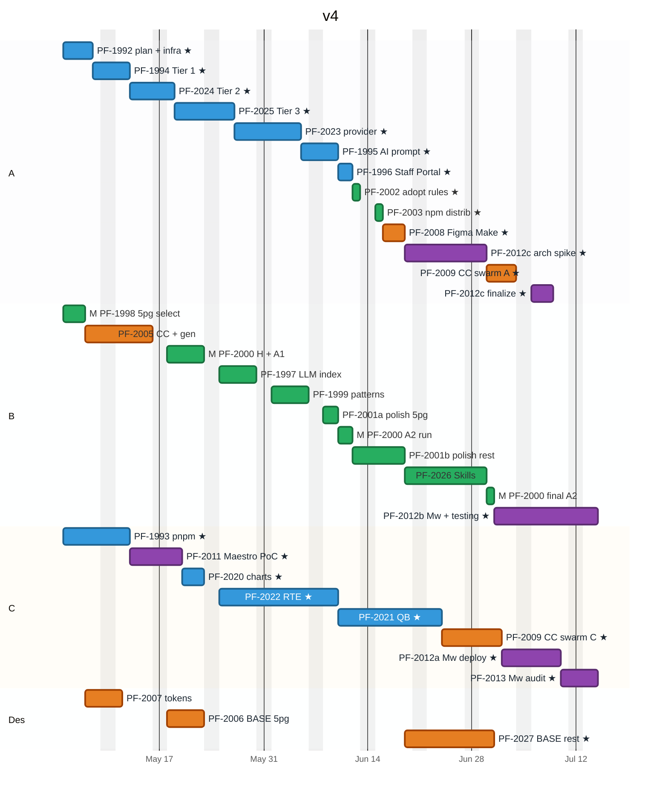

# PI-4318 — Timeline (Final)

**Parent:** [PI-4318 — Picasso Modernization + AI Developer Experience](https://toptal-core.atlassian.net/browse/PI-4318)
**Last updated:** 2026-04-30
**Audience:** Project manager, sponsors, engineers. Source of truth for sprint planning and weekly status.
**Companion doc:** [PI-4318-estimates_final.md](./PI-4318-estimates_final.md) for per-ticket effort.

---

## At a glance

| | |
|---|---|
| **Program start** | **Monday 2026-05-04** |
| **Program end** | **~Jul 14, 2026** (~10 weeks) — all 3 engineers engaged through program end via PF-2012 split + PF-2013 audit pair |
| Engineers | 1 × 100% (Eng A) + 2 × 50% (Eng B, Eng C) + Designer (full availability) |
| Headline measurement (5-page H + A1) | **~May 22** (right after PF-2005 ships the Code Connect generator) |
| Headline measurement (5-page A2 lift) | ~Jun 11 |

**Single biggest decision:** PF-2012 sub-ticket split. After PF-2011 PoC ships ~May 19, define **PF-2012a** (Eng C deploy lead, ~3d effort, Jul 2-9), **PF-2012b** (Eng B monitoring + migration guide + integration testing + PF-2013 audit prep, ~5d effort, Jul 1-14 at 50%), **PF-2012c** (Eng A architecture spike + integration + production hardening, ~10d effort split across two windows: Jun 19-29 spike + Jul 7-9 finalize). Eng A's Jun 19-Jul 1 window — previously idle waiting on PF-2027 — now absorbs the PF-2012c architecture spike, which lets Eng C's PF-2012a deploy lead shrink from 4d → 3d. **Lock the split by ~May 26.**

---

## Resource assumptions

All three engineers and the designer start the week of May 4:

- **Engineer A** — 100% from 2026-05-04. Owns Modernization track end-to-end (PF-1988), the autonomous orchestrator (PF-1992), and the picasso-provider canary (PF-2023). PF-2012c split across two windows: architecture spike Jun 19-29 (after PF-2008 wraps, while waiting on PF-2027 to unblock PF-2009 swarm) + finalize Jul 7-9 (after PF-2009 swarm). Pairs with Eng C on PF-2013 audit Jul 10-14. **Eng A wraps Jul 14** — no idle gaps in the schedule.
- **Engineer B** — 50% from 2026-05-04. Owns Agent Experience track (PF-1989) + Picasso/BASE AI Benchmark track (PF-2030) + agentic Code Connect generator (PF-2005, Figma track). After AIC chain wraps (~Jun 30), contributes PF-2012b — extended scope covering monitoring + migration guide + Maestro integration testing + PF-2013 audit data prep — Jul 1 through Jul 14. Eng B engaged through program end.
- **Engineer C** — 50% from 2026-05-04. Owns Maestro track (PF-1991) + sibling-package supervision (PF-2020/PF-2022/PF-2021) + Code Connect 60 swarm with Eng A (PF-2009). Leads PF-2012a (Maestro deployment lead) Jul 2-9 — compressed from the original 8 cal d to 6 cal d because Eng A's PF-2012c architecture spike pre-positions deployment scripts + Maestro env config. **Leads PF-2013 audit Jul 10-14 paired with Eng A** (Eng C drives the audit; Eng A contributes integration validation + cross-checks + report write-up).
- **Designer** — full availability for design work. Starts ~May 7 (after PF-1998 ships the 5-page component-set). Front-loaded on PF-2007 token mapping + PF-2006 5-page BASE fixes; later pass on PF-2027 remaining ~60 BASE fixes.

---

## Key milestones

| Milestone | Date |
|---|---|
| Program start | **2026-05-04** |
| PF-1992 Migration plan + autonomous-loop infra ships (Eng A) | May 6 |
| PF-1998 5-page component-set published (Eng B) | May 6 |
| PF-1994 Tier 1 autonomous run starts | May 7 |
| PF-2005 Code Connect generator + 5-page CC done (Eng B) | May 15 |
| PF-2011 Maestro PoC done (Eng C) | May 19 |
| **PF-2000 Baseline H + A1 measured (5 pages)** | **~May 22** |
| PF-2025 Tier 3 done (Eng A) | May 26 |
| PF-2023 picasso-provider canary done (Eng A + Eng C pair) | Jun 4 |
| PF-1996 Staff Portal migration done (Eng A) | Jun 11 |
| **PF-2000 A2 baseline measured — headline lift number** | **~Jun 11** |
| PF-2027 BASE remaining ~60 done (Designer) | Jun 30 |
| PF-2012c arch spike done (Eng A) | Jun 29 |
| PF-2009 Code Connect 60 swarm done (Eng A + Eng C) | Jul 6 |
| PF-2012c finalize done (Eng A) | Jul 9 |
| PF-2012a done (Eng C — Maestro deployment lead) | Jul 9 |
| PF-2013 Maestro audit done (Eng C lead + Eng A pair + Eng B audit-data prep) | Jul 14 |
| PF-2012b done (Eng B — extended scope) | Jul 14 |
| **All 3 engineers wrap** | **~Jul 14** |
| **Program end** | **~Jul 14** |

---

## Phase shape

```
Phase 1 — Foundation     May 4 – Jun 5  (5 weeks)
  Modernization plan + autonomous-loop infra (PF-1992)
  pnpm migration (PF-1993)
  5-page selection + component extraction (PF-1998)
  Code Connect generator + 5-page CC (PF-2005)
  Token mapping + BASE 5-page audit (PF-2007 + PF-2006)
  Maestro PoC (PF-2011)
  Tier 1/2/3 autonomous runs (PF-1994/PF-2024/PF-2025)
  Baseline H + A1 measured (PF-2000)  ← informs design of .picasso/ + patterns
  .picasso/ v2 + patterns merged (PF-1997 + PF-1999)

Phase 2 — Scale-up + A2 lift     May 18 – Jul 8  (7 weeks)
  picasso-provider canary (PF-2023)
  Sibling packages (PF-2020 / PF-2022 / PF-2021)
  Polish 5-page docs (PF-2001a)
  A2 baseline run — headline lift (PF-2000)
  Polish remaining ~60 docs + tokens + llms-full.txt (PF-2001b)
  BASE remaining ~60 (PF-2027)
  Skills package (PF-2026)
  Code Connect remaining ~60 swarm (PF-2009)

Phase 3 — Rollout + Maestro tail     Jun 3 – Jul 14  (~6 weeks)
  AI migration prompt + worked examples (PF-1995, Eng A)
  Staff Portal migration (PF-1996, Eng A)
  Adopt rules in Staff Portal (PF-2002, Eng A)
  npm distribution (PF-2003, Eng A)
  Figma Make guidelines + template (PF-2008, Eng A)
  PF-2012c arch spike (Eng A, Jun 19-29) ← absorbs Eng A's idle window
  PF-2012a Maestro deployment lead (Eng C, Jul 2-9, compressed from 8d to 6d)
  PF-2012b Maestro monitoring + migration guide + integration testing + audit prep (Eng B, Jul 1-14, extended scope)
  PF-2009 Code Connect 60 swarm (Eng A + Eng C, Jul 1-6)
  PF-2012c finalize (Eng A, Jul 7-9)
  PF-2013 Maestro audit O4 baseline (Eng C lead + Eng A pair + Eng B audit-data prep, Jul 10-14)
  Final A2 re-run (PF-2000, Eng B Jun 30)
```

Phases overlap heavily — Phase 2 modernization scale-up runs concurrently with Phase 1 Agent Experience / Benchmark work.

---

## Gantt

Tasks are coloured by Jira epic. The `★` marker identifies tasks on the critical path (any starred task slipping pushes the program-end date).

| Track | Colour | Tag in source |
|---|---|---|
| Modernization (PF-1988) | Blue | (default) |
| Agent Experience (PF-1989) | Green | `active` |
| Figma Design-to-Code (PF-1990) | Orange | `done` |
| Maestro Integration (PF-1991) | Purple | `crit` |
| Picasso/BASE AI Benchmark (PF-2030) | Green + `[M]` prefix | `active` (shares colour with AIC; `[M]` distinguishes) |

> **Note on Jira-key alignment.** Some Jira tickets show as multiple bars in the chart because the work splits cleanly into phases — Jira ticket count is unchanged. Specifically: **PF-2001** appears as two bars (`PF-2001a polish 5pg` Phase 1 + `PF-2001b polish rest` Phase 2) but is a single Jira ticket with two acceptance phases. **PF-2012** appears as three bars (`PF-2012a/b/c` per the post-PoC sub-ticket split — Jira sub-tickets to be created after PF-2011 PoC ships ~May 19). **PF-2000** appears as four bars (H+A1 baseline, A2 baseline run, final A2 re-run; plus protocol authoring is rolled into the H+A1 bar) but is a single Jira ticket with multiple measurement runs as acceptance criteria. **PF-2013** shows as one bar on Eng C's row (lead) but Eng A pairs on it Jul 10-14 as documented in the Engineer A schedule prose below.



**How to read the chart:**
- **Bar colour = ticket track**, not engineer. So PF-2009 stays orange (Figma) on both Eng A's row and Eng C's row.
- **Section row = engineer.** Skim down a row to see one engineer's queue.
- **Bar duration:** Eng A bars (100% allocation) = man-days; Eng B/C bars (50%) = man-days × 2; Designer bars = designer-days.
- **`★` marker** = critical path (Chain A or Chain C below).
- **`[M]` prefix** = Picasso/BASE AI Benchmark track (PF-1998 + PF-2000); same green as AIC because Mermaid Gantt has only 4 base tag styles for 5 tracks.

---

## Critical path

The program has two parallel chains; the one that finishes last determines program end.

### Chain A — Eng A modernization core + PF-2012c (no idle gaps; wraps Jul 9)

```
PF-1992 (4d) May 4 - May 7                       [Eng A solo]
  → PF-1994 base/* Tier 1 (3d, autonomous) May 8 - May 12
    → PF-2024 base/* Tier 2 (4d, autonomous) May 13 - May 18
      → PF-2025 base/* Tier 3 (6d) May 19 - May 26
        → PF-2023 provider PAIR (7d) May 27 - Jun 4
          → PF-1995 (3d) Jun 5 - Jun 9
            → PF-1996 Staff Portal (2d) Jun 10 - Jun 11
              → PF-2002 (1d) Jun 12
                → PF-2003 (1d) Jun 15
                  → PF-2008 Figma Make (3d) Jun 16 - Jun 18
                    → PF-2012c arch spike (7d) Jun 19 - Jun 29   [absorbs window between PF-2008 and PF-2009; pre-positions Maestro deployment for Eng C]
                      → PF-2009 CC swarm (4d) Jul 1 - Jul 6     [waits on PF-2027 ending Jun 30]
                        → PF-2012c finalize (3d) Jul 7 - Jul 9
                          → PF-2013 audit pair (3d) Jul 10 - Jul 14   [paired with Eng C; Eng A on integration validation + cross-checks + report write-up]
                            → 🚩 ENG A DONE Jul 14
```

### Chain C — Eng C Maestro tail (program-end determining)

```
PF-1993 pnpm (7 cal d @50%)              May 4 - May 12
  → PF-2011 Maestro PoC (5 cal d)         May 13 - May 19
    → PF-2020 charts (3 cal d)             May 20 - May 22
      → PF-2022 RTE (12 cal d)              May 25 - Jun 9
        → PF-2021 QB (10 cal d)              Jun 10 - Jun 23
          → PF-2009 swarm (6 cal d)           Jun 24 - Jul 1
            → PF-2012a Mw deploy (6 cal d)     Jul 2 - Jul 9    [compressed from 8d because Eng A's PF-2012c arch spike Jun 19-29 pre-positioned deployment scripts + Maestro env config; parallel: PF-2012b Eng B Jul 1-14, PF-2012c finalize Eng A Jul 7-9]
              → PF-2013 audit (3 cal d @50%)    Jul 10 - Jul 14
                → 🚩 PROGRAM END Jul 14
```

The full 3-engineer parallel execution on PF-2012 (with Eng A's arch spike absorbing the previously-idle window Jun 19-29) compresses the Maestro tail another 2 days versus the earlier "3-engineer collab" model. No idle capacity remains in the schedule for any engineer.

---

## Engineer A schedule (100%)

```
May 4  - May 7   PF-1992 Migration plan + autonomous-loop infra (4d)
May 8  - May 12  PF-1994 base/* Tier 1 (3d, autonomous run)
May 13 - May 18  PF-2024 base/* Tier 2 (4d, autonomous)
May 19 - May 26  PF-2025 base/* Tier 3 (6d)
May 27 - Jun 4   PF-2023 picasso-provider canary (7d)              [PAIR with Eng C]
Jun 5  - Jun 9   PF-1995 AI migration prompt (3d)
Jun 10 - Jun 11  PF-1996 Staff Portal migration (2d)
Jun 12           PF-2002 Adopt rules (1d)
Jun 15           PF-2003 npm distribution (1d)
Jun 16 - Jun 18  PF-2008 Figma Make (3d)
Jun 19 - Jun 29  PF-2012c arch spike (7d)                          [Maestro architecture, Figma API integration patterns, deployment script scaffolding, Maestro env access setup — pre-positions PF-2012a Eng C lead]
Jul 1  - Jul 6   PF-2009 Code Connect 60 swarm (4d)                [SWARM with Eng C]
Jul 7  - Jul 9   PF-2012c finalize — production hardening + final integration (3d)  [parallel with PF-2012a Eng C]
Jul 10 - Jul 14  PF-2013 audit pair (3d at 100%)                   [paired with Eng C — Eng A contributes integration validation + cross-checks + audit report write-up]
```

Eng A wraps **Jul 14** with no idle gaps. PF-2012c spike Jun 19-29 + finalize Jul 7-9, plus PF-2013 audit pair Jul 10-14, keeps Eng A engaged continuously through program end.

## Engineer B schedule (50%)

Calendar durations are 2× the man-days because of half-time allocation.

```
May 4  - May 6   PF-1998 5-page selection + extraction (3 cal d, 1.5d effort)
May 7  - May 15  PF-2005 CC generator infra + CC 5-page (7 cal d, 3.5d effort)
May 18 - May 22  PF-2000 protocol + Baseline H + A1 (5 cal d, 2.5d effort) ← baseline numbers in hand
May 25 - May 29  PF-1997 LLM index v2 + .picasso/ (5 cal d, 2.5d effort) ← informed by baseline
Jun 1  - Jun 5   PF-1999 patterns merged into .picasso/ (5 cal d, 2.5d effort) ← informed by baseline
Jun 8  - Jun 9   PF-2001a polish 5-page docs (2 cal d, 1d effort)
Jun 10 - Jun 11  PF-2000 A2 baseline run (2 cal d, 1d effort)
Jun 12 - Jun 18  PF-2001b polish remaining + tokens + llms-full (5 cal d, 2.5d effort)
Jun 19 - Jun 29  PF-2026 Skills package (7 cal d, 3.5d effort)
Jun 30           PF-2000 final A2 re-run (1 cal d, 0.5d effort)
Jul 1  - Jul 3   PF-2012b Mw monitoring + migration guide (3 cal d, 1.5d effort)
```

Eng B wraps **Jul 3**. PF-2000 H + A1 baseline runs immediately after PF-2005 lands, so the AIC layer (PF-1997 + PF-1999) gets designed with the baseline numbers in hand — measurement informs `.picasso/` v2 and pattern extraction, instead of being built blind and measured at the end.

## Engineer C schedule (50% baseline)

The final Maestro window is shown both at sustained 50% and at bumped 100%.

```
May 4  - May 12  PF-1993 pnpm migration (7 cal d, 3.5d effort)
May 13 - May 19  PF-2011 Maestro PoC (5 cal d, 2.5d effort)
May 20 - May 22  PF-2020 charts (3 cal d, 1.5d effort, autonomous + review)
May 25 - Jun 9   PF-2022 RTE (12 cal d, 6d effort, autonomous; Eng A pair-reviews Lexical theme)
May 27 - Jun 4   PF-2023 PAIR with Eng A (interleaved with RTE, no extra cal time — design-review meetings)
Jun 10 - Jun 23  PF-2021 query-builder (10 cal d, 5d effort, autonomous + review)
Jun 24 - Jul 1   PF-2009 SWARM with Eng A (6 cal d, ~3d effort on Eng C side)
Jul 2  - Jul 9   PF-2012a Mw deployment lead (6 cal d @50%, 3d effort)  [compressed from 8 cal d because Eng A's PF-2012c arch spike Jun 19-29 pre-positioned deployment scripts + Maestro env config]
Jul 10 - Jul 14  PF-2013 Maestro audit (3 cal d @50%, 1.5d effort)
```

Eng C wraps **Jul 14**. The full 3-engineer parallel execution on PF-2012 (Eng A spike + Eng B extended + Eng C lead) compresses the Maestro tail from the original 16 cal d (Eng C solo) down to 8 cal d (Jul 2-9 deploy + Jul 10-14 audit).

## Designer schedule

```
May 7  - May 11  PF-2007 Token mapping (3 weekdays, after PF-1998)
May 18 - May 22  PF-2006 BASE 5-page audit (5 weekdays, after PF-2005 + PF-2007)
(idle May 25 - Jun 18)
Jun 19 - Jun 30  PF-2027 BASE remaining ~60 components (8 weekdays, after PF-2001b)
```

Designer wraps **Jun 30**. The mid-program idle window is when Eng B is doing patterns + measurement work that doesn't need designer input.

---

## Cross-track dependency map

Dependencies that cross epic boundaries (the ones to watch in Jira link views):

- **PF-1998 (Benchmark)** → PF-2005 / PF-2006 / PF-2007 / PF-2001a — 5-page component set is the working scope for Phase 1 Figma + AIC + Benchmark work.
- **PF-1992 (Mod) + PF-1993 (Mod)** → PF-1994 — migration plan + pnpm are prereqs for Tier 1.
- **PF-1994 Tier 1** → PF-2020 / PF-2021 / PF-2022 — sibling-package migrations need the Tier 1 primitives.
- **PF-2025 + sibling packages** → PF-2023 — picasso-provider canary runs LAST, after every consumer is migrated.
- **PF-2005** → PF-2006 — Code Connect generator + Figma MCP setup is prereq for Designer's BASE audit.
- **PF-1997 + PF-2005 + PF-2001a** → PF-2000 A2 — A2 baseline needs the full pipeline live for the 5-page subset.
- **PF-2001b** → PF-2027 — polished 75-component docs are the input for the BASE audit on the remaining ~60.
- **PF-2027** → PF-2009 — BASE alignment for the remaining ~60 must close before the Code Connect swarm can generate clean snippets.
- **PF-2011** → PF-2012a/b/c — Maestro PoC informs the production split. After PoC ships ~May 19, define the 3 sub-tickets so all three engineers can prepare in parallel.
- **PF-2001b + PF-2026** → PF-2003 — npm distribution ships the polished docs + Skills.

---

## Risks

| # | Risk | Likelihood | Impact | Mitigation |
|---|---|---|---|---|
| 1 | 5-page selection misrepresents Picasso breadth → A1/A2 numbers don't generalize | Medium | Medium | Pick pages spanning forms, layouts, data-display, navigation, feedback. Vedran + designer sign-off on selection. |
| 2 | PF-2012 sub-ticket split mis-scoped — Eng A/B/C can't actually parallelise | Medium | Medium (program ends ~Jul 23 instead of ~Jul 16) | Lock the split by ~May 26 (after PF-2011 PoC). Validate that each sub-ticket has bounded scope without dependency cycles between A/B/C work. |
| 3 | Modernization scale-up fails (autonomous agent escalation rate >50% on Tier 1) | Low | High (Phase 2 stretches) | Note (Tier 1 sandbox) validates by May 6. Pause + improve prompt before scaling. |
| 4 | Tier 3 architectural surprises (PicassoProvider.override chains we didn't audit) | Medium | Medium (per-component cost can double) | Front-load `PicassoProvider.override` audit in PF-1992. |
| 5 | A2 measurement at end of Phase 1 shows little A1 → A2 lift | Medium | Medium (program loses headline AI-DX value) | Re-run A2 incrementally (after PF-2005, after PF-1997, after PF-2001a) to catch the lift gap early. |
| 6 | Designer availability drops during M5 scoring or PF-2001b / PF-2027 review | Low | Medium (those calendars stretch) | Schedule designer time explicitly for the M5 window (Jun 1-5 + Jun 10-11 + Jun 30) and PF-2027 (Jun 19-30). |
| 7 | Maestro production hardening hits unforeseen integration issues | Medium | Medium (PF-2012 stretches) | PF-2011 PoC includes a productionization estimate; review by ~May 19 before locking PF-2012 scope. |

---

## Key decisions to lock

1. **PF-2012 sub-ticket split + PF-2013 audit pair** (after PF-2011 PoC ships ~May 19). Define PF-2012a (Eng C deploy lead, ~3d), PF-2012b (Eng B monitoring + guide + integration testing + audit prep, ~5d), PF-2012c (Eng A architecture spike + integration + hardening, ~10d), PF-2013 audit (Eng C lead + Eng A pair, ~3d combined). **Lock by ~May 26.**
2. **5-page selection** (Vedran + designer). **Decide by May 6** (gates PF-2005, PF-2006, PF-2000 H baseline).
3. **Figma MCP access** for 3-5 pilot engineers. **Wire by May 7** (gates PF-2005 generator build).
4. **Local Happo from a branch** (vs CI). If feasible, fold into PF-1992 deliverables; potentially compresses per-component cycle 10-20%. **Decide by May 4** (start of PF-1992).
5. **Tier 1 calibration review** (after PF-1994 wraps ~May 12). Recalibrate Tier 2/3 + sibling-package estimates from real data before locking Phase 2 commitments.

---

## Update cadence

Update this doc when:
- A milestone slips by >3 working days
- Eng allocation changes
- A new ticket lands in scope (or one is cut)
- After PF-1994 Tier 1 wraps (recalibrate Tier 2/3 multipliers from real data)
- The 5-page A2 measurement publishes (~Jun 11) — confirm headline lift number

---

## Sources

- [PI-4318-estimates_final.md](./PI-4318-estimates_final.md) — per-track and per-ticket effort breakdown
- [PI-4318-tickets-by-track.md](./PI-4318-tickets-by-track.md) — full ticket descriptions, acceptance criteria, dependencies
- [PI-4318-P1-MOD-01-migration-plan.md](./PI-4318-P1-MOD-01-migration-plan.md) — Modernization migration plan and tier inventory
- [PI-4318-phases.md](./PI-4318-phases.md) — measurement harness specification (M1-M5 metrics) used by PF-2000
