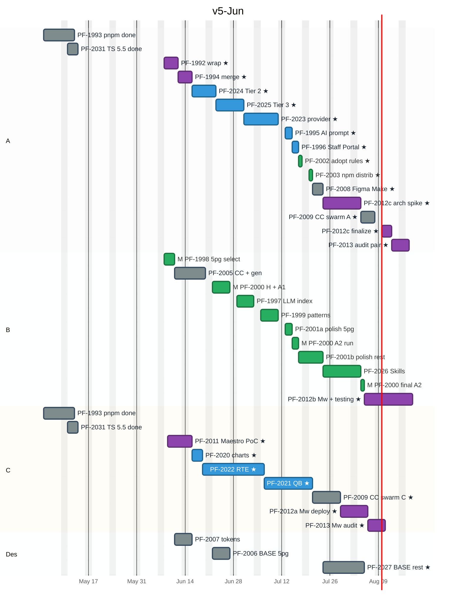

# PI-4318 — Timeline (June re-baseline)

**Parent:** [PI-4318 — Picasso Modernization + AI Developer Experience](https://toptal-core.atlassian.net/browse/PI-4318)
**Last updated:** 2026-06-05
**Audience:** Project manager, sponsors, engineers. Source of truth for sprint planning and weekly status as of June 5, 2026.
**Supersedes:** [PI-4318-timeline_final.md](./PI-4318-timeline_final.md) (April 2026 baseline). The April timeline is preserved as-is for audit; this doc shows the re-planned calendar from June 5 onwards.
**Companion doc:** [PI-4318-estimates_jun.md](./PI-4318-estimates_jun.md) for per-track effort and progress.

---

## At a glance — June re-baseline

| | |
|---|---|
| Original program start | 2026-05-04 |
| Re-baseline date | **2026-06-05** |
| **Original program end** | ~Jul 14, 2026 |
| **Revised program end** | **~Aug 14, 2026** (range Aug 7 – Aug 21) |
| **Slip from original** | **~4-5 weeks** |
| Engineers | 1 × 100% (Eng A) + 2 × 50% (Eng B, Eng C) + Designer (full availability) |
| **Headline measurement (5-page H + A1)** | ~Jun 26 (was May 22) |
| **Headline measurement (5-page A2 lift)** | ~Jul 17 (was Jun 11) |
| Critical-path engineer | Eng A (Modernization chain) for the first 5-6 weeks; Eng B (Agent Experience + Figma + Pilot Measurement) for the program tail |

**Single biggest decision this week:** Lock Eng B's 50% allocation from Jun 8. Eng B's chain (Agent Experience + Figma Code Connect generator + Pilot Measurement) hasn't started yet — if it doesn't ramp now, program-end slips further into late August or September.

---

## What happened in the first 5 weeks (May 4 – Jun 5)

| Story | Track | Owner | Status | Effort spent vs estimate |
|---|---|---|---|---|
| [PF-1993](https://toptal-core.atlassian.net/browse/PF-1993) pnpm migration | Modernization | Eng C | **Done** | ~3-5d (on estimate) |
| [PF-2031](https://toptal-core.atlassian.net/browse/PF-2031) TypeScript 5.5 upgrade | (separate Phase-1 prereq) | Eng C | **Done** | ~2-3d (on estimate) |
| [PF-1992](https://toptal-core.atlassian.net/browse/PF-1992) Migration plan + orchestrator | Modernization | Eng A | **In Progress** (~85%) | **~12-15d (3-4× over the 4-5d estimate)** |
| [PF-1994](https://toptal-core.atlassian.net/browse/PF-1994) Tier 1 + Tier 0 batch | Modernization | Eng A | **In Review** (PRs landing) | ~3-5d (on estimate) |
| [PF-1998](https://toptal-core.atlassian.net/browse/PF-1998) 5-page selection | Pilot Measurement | Eng B | **To Do** (advanced past Backlog) | ~0d |
| _All other 23 stories_ | AIC / Figma / Maestro / Pilot Measurement | Eng B + Eng C + Designer | **Backlog — not started** | 0d |

**Root cause of slip.** PF-1992 absorbed ~12-15 engineer days instead of the budgeted 4-5d. The design conversations during that window produced 4 plan revisions (v1 → v4), a consolidated decisions doc, and architectural lock-in for 5 cross-cutting choices (Backdrop replacement, Popper replacement, `classes` prop shim, integration branch model, pipelined orchestrator state machine). That overrun was Eng A's full attention; Eng B's parallel chain never started; Eng C delivered the Phase-1 prereqs (PF-1993 + PF-2031) instead of Maestro PoC.

---

## Resource assumptions (revised for June onwards)

- **Engineer A** — 100% from Jun 5. Continues Modernization track. Wraps PF-1992 + PF-1994 in the next ~1 week, then PF-2024 → PF-2025 → PF-2023 → PF-1995 → PF-1996 chain. Eng A primary chain wraps ~Jul 17. After that contributes to Figma 55-component swarm (PF-2009), Maestro architecture spike (PF-2012c), and PF-2013 audit pair.
- **Engineer B** — 50% from Jun 8 onwards (assumed). **Not engaged in May.** Owns Agent Experience track + Pilot Measurement + Figma Code Connect generator. Starts PF-1998 + PF-2005 in parallel. After AIC chain wraps (~mid-late July), contributes to Maestro production (PF-2012b) and Eng A's Figma swarm tail. **Eng B 50% allocation lock is the highest-stakes decision this week.**
- **Engineer C** — 50% from Jun 9 (PF-2011 PoC start). Did Phase-1 prereqs in May (PF-1993 + PF-2031). Sibling-package supervision starts once PF-1994 merges (PF-2020 → PF-2022 → PF-2021). Then PF-2009 Code Connect 55-component swarm pair, PF-2012a Maestro deployment lead, PF-2013 audit pair with Eng A.
- **Designer** — full availability from when PF-1998 / PF-1998 outputs land (~Jun 12). Front-loaded on PF-2007 tokens + PF-2006 BASE 5-page audit; later pass on PF-2027 BASE remaining 55.

---

## Key milestones (revised)

| Milestone | Original date | Revised date | Slip |
|---|---|---|---|
| Program start | 2026-05-04 | (unchanged) | — |
| PF-1992 migration plan + autonomous-loop ships (Eng A) | May 6 | **~Jun 12** | +5 weeks |
| PF-1994 Tier 1 + Tier 0 autonomous run completes | May 12 | **~Jun 13** | +4-5 weeks |
| PF-1998 5-page component-set published (Eng B) | May 6 | **~Jun 10** | +5 weeks |
| PF-2005 Code Connect generator + 5-page CC done (Eng B) | May 15 | **~Jun 26** | +6 weeks |
| PF-2011 Maestro PoC done (Eng C) | May 19 | **~Jun 17** | +4 weeks |
| **PF-2000 Baseline H + A1 measured (5 pages)** | **~May 22** | **~Jun 26** | +5 weeks |
| PF-2025 Tier 3 done (Eng A) | May 26 | **~Jul 3** | +5-6 weeks |
| PF-2023 picasso-provider canary done | Jun 4 | **~Jul 14** | +5-6 weeks |
| PF-1996 Staff Portal migration done (Eng A) | Jun 11 | **~Jul 17** | +5 weeks |
| **PF-2000 A2 baseline measured — headline lift number** | **~Jun 11** | **~Jul 17** | +5 weeks |
| PF-2027 BASE remaining ~55 done (Designer) | Jun 30 | **~Aug 3** | +5 weeks |
| PF-2012c arch spike done (Eng A) | Jun 29 | **~Jul 31** | +4-5 weeks |
| PF-2009 Code Connect 55 swarm done (Eng A + Eng C) | Jul 6 | **~Aug 7** | +4-5 weeks |
| PF-2012a/c finalize done | Jul 9 | **~Aug 10** | +4-5 weeks |
| PF-2013 Maestro audit done | Jul 14 | **~Aug 14** | +4-5 weeks |
| **All 3 engineers wrap** | **~Jul 14** | **~Aug 14** | **+4-5 weeks** |
| **Program end** | **~Jul 14** | **~Aug 14** (range Aug 7 – Aug 21) | **+4-5 weeks** |

---

## Phase shape (re-baselined)

```
Phase 1 burned (May 4 – Jun 5, 5 weeks)
  ✓ PF-1993 pnpm migration
  ✓ PF-2031 TypeScript 5.5 upgrade (separate Phase-1 prereq)
  ~ PF-1992 Migration plan + orchestrator infra (~85%, ~3-5d remaining)
  ~ PF-1994 Tier 1 cleanup + Tier 0 light-path batch (In Review)

Phase 2 — Modernization core + AIC/Figma kickoff   Jun 8 – Jul 17 (~6 weeks)
  PF-1992 wrap + PF-1994 merge
  PF-2024 Tier 2 heavy (Checkbox, Radio, Tooltip, FileInput, Popper)
  PF-2025 Tier 3 composite (Accordion, Dropdown, Page) + OutlinedInput
  PF-2023 picasso-provider canary
  Eng B parallel: PF-1998 + PF-2005 + PF-1997 + PF-1999 + PF-2000 baseline (H + A1)
  Eng C parallel: PF-2011 Maestro PoC + PF-2020 charts + PF-2022 RTE
  Designer parallel: PF-2007 tokens + PF-2006 BASE 5-page

Phase 3 — A2 lift + sibling tail + AIC polish      Jul 13 – Aug 7 (~3.5 weeks)
  PF-1996 Staff Portal migration canary
  PF-2001a/b polish + PF-2026 Skills
  PF-2002 + PF-2003 Agent Experience rollout
  PF-2021 QB + PF-2009 Code Connect 55 swarm
  PF-2027 BASE remaining 55
  PF-2000 A2 measurement (headline lift)
  PF-2008 Figma Make guidelines

Phase 4 — Maestro production tail                    Aug 3 – Aug 14 (~2 weeks)
  PF-2012a Maestro deployment lead (Eng C)
  PF-2012b monitoring + integration testing + audit prep (Eng B)
  PF-2012c arch spike + finalize (Eng A)
  PF-2013 audit pair
  PF-2000 final A2 re-run + sentiment survey
  Program end ~Aug 14
```

---

## Re-baselined Mermaid Gantt



**How to read.**
- **Grey bars** = completed in May (PF-1993, PF-2031 on Eng A's and Eng C's rows — Eng C actually did the work, shown on both rows for visibility).
- **Purple bars** = critical path Chain A or Chain C — what determines program end.
- **Blue/green bars** = on the path but not gating the end date.
- **`M` prefix** = Pilot Measurement track (PF-1998, PF-2000 sub-runs).
- **`★`** = critical path through Eng A or Eng C.

The chart starts the active execution on **Jun 8** because that's the first realistic Monday after the re-baseline. PF-1992 wrap + PF-1994 merge consume the first ~6 working days.

---

## Critical path — June re-baseline

Two parallel chains. The one that finishes last determines program end.

### Chain A — Eng A modernization + program-tail Maestro spike (wraps ~Aug 14)

```
PF-1992 wrap (4d)         Jun 8 – Jun 11           [Eng A solo, residual orchestrator code]
  → PF-1994 merge (2d)    Jun 12 – Jun 15           [review-bound]
    → PF-2024 Tier 2 (5d)  Jun 16 – Jun 22
      → PF-2025 Tier 3 (6d) Jun 23 – Jul 1
        → PF-2023 provider (8d, PAIR with Eng C)
                              Jul 2 – Jul 14
          → PF-1995 (2d)       Jul 15 – Jul 16
            → PF-1996 (2d)      Jul 17 – Jul 20
              → PF-2002 (1d)     Jul 21
                → PF-2003 (1d)    Jul 22
                  → PF-2008 (3d)   Jul 23 – Jul 27
                    → PF-2012c spike (7d)  Jul 28 – Aug 5
                      → PF-2009 swarm (4d) Aug 6 – Aug 11   [SWARM with Eng C]
                        → PF-2012c finalize (3d) Aug 12 – Aug 14
                          → PF-2013 audit pair (3d at 100%) Aug 14
                            → 🏁 ENG A DONE Aug 14
```

### Chain C — Eng C sibling + Maestro tail (wraps ~Aug 14)

```
PF-2011 Maestro PoC (5 cal d)           Jun 9 – Jun 15
  → PF-2020 charts (3 cal d @50%)        Jun 16 – Jun 18    [requires PF-1994 merged]
    → PF-2022 RTE (12 cal d @50%)         Jun 19 – Jul 6
      → PF-2021 QB (10 cal d @50%)         Jul 7 – Jul 20
        → PF-2009 swarm (6 cal d @50%)       Jul 21 – Jul 28  [SWARM with Eng A]
          → PF-2012a Mw deploy (6 cal d @50%) Jul 29 – Aug 7
            → PF-2013 Mw audit (3 cal d @50%) Aug 11 – Aug 14
              → 🏁 ENG C DONE Aug 14
```

### Chain B — Eng B Agent Experience + Pilot Measurement + Figma support (wraps ~Aug 7-14)

```
PF-1998 5pg select (3 cal d @50%)     Jun 8 – Jun 10
  → PF-2005 CC + gen (7 cal d @50%)    Jun 11 – Jun 25
    → PF-2000 H+A1 baseline (5 cal d)   Jun 22 – Jun 26  ← headline H+A1 ~Jun 26
      → PF-1997 LLM index (5 cal d)      Jun 29 – Jul 3
        → PF-1999 patterns (5 cal d)      Jul 6 – Jul 10
          → PF-2001a polish 5pg (2 cal d)  Jul 13 – Jul 14
            → PF-2000 A2 run (2 cal d)      Jul 15 – Jul 16   ← headline A2 lift ~Jul 17
              → PF-2001b polish rest (5 cal d) Jul 17 – Jul 23
                → PF-2026 Skills (7 cal d)    Jul 24 – Aug 4
                  → PF-2000 final A2 (1 cal d) Aug 5
                    → PF-2012b Mw monitoring + audit prep (10 cal d @50%)
                                              Aug 6 – Aug 14
                      → 🏁 ENG B DONE Aug 14
```

All three engineers wrap on or about Aug 14. The Aug 7 – Aug 21 range comes from variance in the heavy Tier 2/3 components, the provider rewrite, and the Eng B chain ramp speed.

---

## Engineer A schedule (100% — Modernization track + Maestro architecture)

```
Jun 8  – Jun 11   PF-1992 wrap (4d) — orchestrator state machine refactor, Slack webhook, Happo gate, classes shim, decision docs
Jun 12 – Jun 15   PF-1994 merge (2d, review-bound)
Jun 16 – Jun 22   PF-2024 Tier 2 heavy (5d, autonomous via orchestrator)
Jun 23 – Jul 1    PF-2025 Tier 3 composite + OutlinedInput (6d)
Jul 2  – Jul 14   PF-2023 picasso-provider canary (8d) [PAIR with Eng C]
Jul 15 – Jul 16   PF-1995 AI migration prompt (2d)
Jul 17 – Jul 20   PF-1996 Staff Portal migration (2d)
Jul 21            PF-2002 Adopt rules in Staff Portal (1d)
Jul 22            PF-2003 npm distribution (1d)
Jul 23 – Jul 27   PF-2008 Figma Make guidelines (3d)
Jul 28 – Aug 5    PF-2012c arch spike (7d)                       [pre-positions Eng C's Maestro deploy]
Aug 6  – Aug 11   PF-2009 Code Connect 55 swarm (4d)              [SWARM with Eng C]
Aug 12 – Aug 14   PF-2012c finalize (3d) + PF-2013 audit pair    [paired with Eng C]
                  🏁 ENG A DONE Aug 14
```

Eng A wraps Aug 14 with no idle gaps.

---

## Engineer B schedule (50% — Agent Experience + Pilot Measurement + Figma)

Calendar durations are 2× the man-days because of half-time allocation.

```
Jun 8  – Jun 10   PF-1998 5-page selection + extraction (3 cal d, 1.5d effort)
Jun 11 – Jun 25   PF-2005 CC generator infra + CC 5-page (10 cal d, 5d effort)
Jun 22 – Jun 26   PF-2000 protocol + Baseline H + A1 (5 cal d, 2.5d effort) ← H+A1 baseline ~Jun 26
Jun 29 – Jul 3    PF-1997 LLM index v2 + .picasso/ (5 cal d, 2.5d effort)
Jul 6  – Jul 10   PF-1999 patterns merged into .picasso/ (5 cal d, 2.5d effort)
Jul 13 – Jul 14   PF-2001a polish 5-page docs (2 cal d, 1d effort)
Jul 15 – Jul 16   PF-2000 A2 baseline run (2 cal d, 1d effort) ← headline A2 lift ~Jul 17
Jul 17 – Jul 23   PF-2001b polish remaining + tokens + llms-full (5 cal d, 2.5d effort)
Jul 24 – Aug 4    PF-2026 Skills package (7 cal d, 3.5d effort)
Aug 5             PF-2000 final A2 re-run (1 cal d, 0.5d effort)
Aug 6  – Aug 14   PF-2012b Mw monitoring + migration guide + audit prep (7 cal d, 3.5d effort)
                  🏁 ENG B DONE Aug 14
```

**Critical**: this schedule assumes Eng B starts Jun 8 at 50%. If allocation lock slips a week, every downstream date slips a week.

---

## Engineer C schedule (50% — Maestro track + sibling-package supervision)

```
May 4  – May 12   PF-1993 pnpm migration (done, 7 cal d, 3.5d effort)
May 11 – May 14   PF-2031 TypeScript 5.5 (done, ~3 cal d, 2-3d effort)
Jun 9  – Jun 15   PF-2011 Maestro PoC (5 cal d, 2.5d effort)
Jun 16 – Jun 18   PF-2020 charts (3 cal d, 1.5d effort)                  [requires PF-1994 merged]
Jun 19 – Jul 6    PF-2022 RTE (12 cal d, 6d effort, autonomous; Eng A pair-reviews Lexical theme)
Jul 2  – Jul 14   PF-2023 PAIR with Eng A (interleaved with RTE end, design-review meetings)
Jul 7  – Jul 20   PF-2021 query-builder (10 cal d, 5d effort)
Jul 21 – Jul 28   PF-2009 SWARM with Eng A (6 cal d, ~3d effort on Eng C side)
Jul 29 – Aug 7    PF-2012a Mw deployment lead (6 cal d @50%, 3d effort)  [compressed because Eng A's PF-2012c arch spike pre-positions deployment scripts]
Aug 11 – Aug 14   PF-2013 Maestro audit (3 cal d @50%, 1.5d effort)
                  🏁 ENG C DONE Aug 14
```

Eng C wraps Aug 14.

---

## Designer schedule

```
Jun 11 – Jun 17   PF-2007 Token mapping (3 weekdays, after PF-1998)
Jun 22 – Jun 26   PF-2006 BASE 5-page audit (5 weekdays, after PF-2005 + PF-2007)
(idle Jun 29 – Jul 22)
Jul 23 – Aug 5    PF-2027 BASE remaining ~55 components (8 weekdays, after PF-2001b)
                  🏁 DESIGNER DONE Aug 5
```

Designer wraps Aug 5. The mid-program idle window is when Eng B is doing patterns + measurement work that doesn't need designer input.

---

## Cross-track dependency map (unchanged from April baseline)

- **PF-1998 (Benchmark)** → PF-2005 / PF-2006 / PF-2007 / PF-2001a — 5-page component set is the working scope.
- **PF-1992 (Mod) + PF-1994** → PF-2020 / PF-2021 / PF-2022 — orchestrator + Tier 1+0 must ship before sibling packages.
- **PF-2025 + sibling packages** → PF-2023 — picasso-provider canary runs LAST.
- **PF-2005** → PF-2006 — Code Connect generator + Figma MCP is prereq for Designer's BASE audit.
- **PF-1997 + PF-2005 + PF-2001a** → PF-2000 A2 — A2 baseline needs the full pipeline live for the 5-page subset.
- **PF-2001b** → PF-2027 — polished 75-component docs are the input for the BASE audit on the remaining ~55.
- **PF-2027** → PF-2009 — BASE alignment must close before Code Connect swarm.
- **PF-2011** → PF-2012a/b/c — Maestro PoC informs the production split.

---

## Risks — June assessment

| # | Risk | Likelihood | Impact | Mitigation |
|---|---|---|---|---|
| 1 | Eng B doesn't ramp to 50% in June | Medium | High (program end slips further into late August / September) | **Lock Eng B allocation this week (by Jun 12).** Communicate timeline impact to Eng B's manager. |
| 2 | PF-1992 has further slip beyond the 3-5d residual | Low-Medium | Medium (every downstream date slips 1:1) | Orchestrator prompt for the Claude Code session is in place ([PI-4318-PF-1992-orchestrator-prompt.md](./PI-4318-PF-1992-orchestrator-prompt.md)); 10-step execution plan with explicit per-step budgets. |
| 3 | PF-1994 review takes more than 2-3 days | Medium | Medium (Tier 2 start slips by review-cycle length) | Surface PF-1994 for review now; ensure reviewer is engaged. |
| 4 | Tier 2/3 calibration off (PR #4906 multipliers don't generalise to Drawer / Modal / Slider) | Medium | Medium (PF-2024 stretches 1-3d) | Run first 2-3 Tier 0 components serially before parallelising; recalibrate after PF-1994 wraps. |
| 5 | Maestro production hits unforeseen integration issues | Medium | Medium (PF-2012 stretches) | PF-2011 PoC includes a productionization estimate; review by ~Jun 17 before locking PF-2012 scope. |
| 6 | Designer availability drops during M5 scoring window (Jun 22-26 + Jul 15-17 + Aug 5) or PF-2027 (Jul 23 – Aug 5) | Low | Medium | Schedule designer time explicitly for those windows. |
| 7 | Phase 1 gating decision invalidated (program already in Phase 2 execution by Jun) | Low | Low | Run Phase 1 gating measurement (PF-2000 H+A1) as an informational check, not a Go/No-Go blocker. Document the deviation from the April gate-policy. |

---

## Key decisions to lock this week (by Jun 12)

1. **Eng B allocation lock at 50% from Jun 8.** Highest-stakes decision; everything else depends on it. (§Resource assumptions)
2. **PF-2012 sub-ticket split timing.** Confirm the A+B+C split after PF-2011 PoC ships (~Jun 17). Lock by Jun 24.
3. **PR #4906 status.** Verify whether merged and on `@base-ui/react`. Reference implementations depend on this. (Migration plan §9.6)
4. **PF-1994 review prioritisation.** Surface for reviewer; flag delay-impact on downstream dates.
5. **Aug 14 due-date communication.** Communicate the revised end-date to sponsors. Note the Aug 7 (best case) – Aug 21 (worst case) range and the Eng B allocation dependency.

---

## Update cadence

Update this doc when:

- A milestone slips by >3 working days
- Eng allocation changes
- A new ticket lands in scope (or one is cut)
- After PF-1994 merges (recalibrate Tier 2/3 multipliers from real data)
- After PF-2011 Maestro PoC ships (~Jun 17) — PF-2012 sub-ticket split locks
- The 5-page A2 measurement publishes (~Jul 17) — confirm headline lift number
- Weekly status check-in

---

## Sources

- [PI-4318-estimates_jun.md](./PI-4318-estimates_jun.md) — per-track and per-ticket effort + progress against April baseline
- [PI-4318-estimates_final.md](./PI-4318-estimates_final.md) — April baseline estimates (preserved as-is for diff/audit)
- [PI-4318-timeline_final.md](./PI-4318-timeline_final.md) — April baseline timeline (preserved as-is)
- [PI-4318-P1-MOD-01-migration-plan.md](./PI-4318-P1-MOD-01-migration-plan.md) — Modernization migration plan v4
- [PI-4318-PF-1992-design-decisions.md](./PI-4318-PF-1992-design-decisions.md) — May 4-5 design decisions consolidated
- [PI-4318-PF-1992-orchestrator-prompt.md](./PI-4318-PF-1992-orchestrator-prompt.md) — Claude Code session prompt for finishing PF-1992
